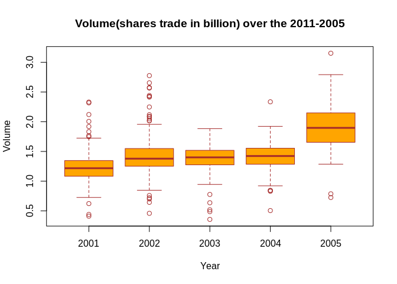
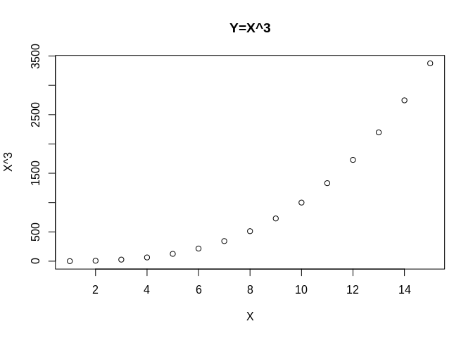

```r
knitr::opts_chunk$set(message=FALSE,warning=FALSE,fig.path = "README_figs/README-" ) 
```
THE STOCK MARKET DATA

We work with Smarket dataset:

Lag1-Lag5 --> Percentage of returns for each of the five previous days
Volume --> Number of shares trades on previous day in billions
Today --> The percentage return on the date in question
Direction -->If the market was up or down on the specific date


```r
library(ISLR) #Load the library plus some basic inspection
names(Smarket)
```

```
## [1] "Year"      "Lag1"      "Lag2"      "Lag3"      "Lag4"      "Lag5"     
## [7] "Volume"    "Today"     "Direction"
```

```r
dim(Smarket)
```

```
## [1] 1250    9
```

```r
summary(Smarket)
```

```
##       Year           Lag1                Lag2                Lag3          
##  Min.   :2001   Min.   :-4.922000   Min.   :-4.922000   Min.   :-4.922000  
##  1st Qu.:2002   1st Qu.:-0.639500   1st Qu.:-0.639500   1st Qu.:-0.640000  
##  Median :2003   Median : 0.039000   Median : 0.039000   Median : 0.038500  
##  Mean   :2003   Mean   : 0.003834   Mean   : 0.003919   Mean   : 0.001716  
##  3rd Qu.:2004   3rd Qu.: 0.596750   3rd Qu.: 0.596750   3rd Qu.: 0.596750  
##  Max.   :2005   Max.   : 5.733000   Max.   : 5.733000   Max.   : 5.733000  
##       Lag4                Lag5              Volume           Today          
##  Min.   :-4.922000   Min.   :-4.92200   Min.   :0.3561   Min.   :-4.922000  
##  1st Qu.:-0.640000   1st Qu.:-0.64000   1st Qu.:1.2574   1st Qu.:-0.639500  
##  Median : 0.038500   Median : 0.03850   Median :1.4229   Median : 0.038500  
##  Mean   : 0.001636   Mean   : 0.00561   Mean   :1.4783   Mean   : 0.003138  
##  3rd Qu.: 0.596750   3rd Qu.: 0.59700   3rd Qu.:1.6417   3rd Qu.: 0.596750  
##  Max.   : 5.733000   Max.   : 5.73300   Max.   :3.1525   Max.   : 5.733000  
##  Direction 
##  Down:602  
##  Up  :648  
##            
##            
##            
## 
```

We use cor() to produce a matrix that contains all the pairwise correlations among the predictors.

```r
library(corrplot)
corrplot(cor(Smarket[,1:8]),method="circle",type= "upper") #We esclude the direction because is qualitative
```

<!-- -->

There is only a (linear) correlation (about 0.5) between Year and Volume predictors. The volume increases over the time, the average number of shares daily increase from 2001 to 2005.

Correlations between the lag vars and today is zero --> no correlation between today return and previous return


```r
boxplot(Volume~Year, data=Smarket, main="Volume(shares trade in billion) over the 2011-2005",xlab="Year",ylab="Volume",col="orange",border ="brown") #The average daily shares (avg volume) traded increase by the year!!! (cor index = 0.5)
```

<!-- -->

LOGISTIC REGRESSION:

Now we fit a logistic regression to predict the Direction using Lag1-Lag5 and Volume.

glm()-->generalized linear models, a class of model that includes the logistic regression.

```r
glm.fits = glm(Direction~Lag1+Lag2+Lag3+Lag4+Lag5+Volume,data = Smarket,family=binomial)
#family=binomial tells R to use logistic regression among the class of generalized linear model.
summary(glm.fits)
```

```
## 
## Call:
## glm(formula = Direction ~ Lag1 + Lag2 + Lag3 + Lag4 + Lag5 + 
##     Volume, family = binomial, data = Smarket)
## 
## Deviance Residuals: 
##    Min      1Q  Median      3Q     Max  
## -1.446  -1.203   1.065   1.145   1.326  
## 
## Coefficients:
##              Estimate Std. Error z value Pr(>|z|)
## (Intercept) -0.126000   0.240736  -0.523    0.601
## Lag1        -0.073074   0.050167  -1.457    0.145
## Lag2        -0.042301   0.050086  -0.845    0.398
## Lag3         0.011085   0.049939   0.222    0.824
## Lag4         0.009359   0.049974   0.187    0.851
## Lag5         0.010313   0.049511   0.208    0.835
## Volume       0.135441   0.158360   0.855    0.392
## 
## (Dispersion parameter for binomial family taken to be 1)
## 
##     Null deviance: 1731.2  on 1249  degrees of freedom
## Residual deviance: 1727.6  on 1243  degrees of freedom
## AIC: 1741.6
## 
## Number of Fisher Scoring iterations: 3
```

We have only a predictor that could be related to the responce: Lag1 (lowest P-value).

The parameter for lag1 is negative --> if the return of previous day is positive than the probability of today to go up (Direction) decreases. But here the P-value is too large (0.144) --> no statistically significance -->no correlation between Lag1 and Direction!!!


```r
glm.probs = predict(glm.fits, type="response") # type="respomce"-->gives probability of the form P(y=1|X).If you dont tell on which data you'll do prediction is calculated on training set used for the fit.
glm.probs[1:10]
```

```
##         1         2         3         4         5         6         7         8 
## 0.5070841 0.4814679 0.4811388 0.5152224 0.5107812 0.5069565 0.4926509 0.5092292 
##         9        10 
## 0.5176135 0.4888378
```

```r
contrasts(Smarket$Direction) #So P(y=1|X), Y=1--> Up
```

```
##      Up
## Down  0
## Up    1
```

Now we need to convert our arrey of prediction (glm.probs) as an array with "up" and "down"


```r
glm.pred=rep("Down",1250) #We create an array with 1250 values, fills with "Down"
glm.pred[glm.probs>0.5] = "Up" #we fill the array with "Up" if the probability of this value in glm.probs array is > 0.5
```

Now we plot the confusion matrix


```r
table(glm.pred,Smarket$Direction)
```

```
##         
## glm.pred Down  Up
##     Down  145 141
##     Up    457 507
```


```r
print("Accuracy on Training Set is: ")
```

```
## [1] "Accuracy on Training Set is: "
```

```r
mean(glm.pred==Smarket$Direction) #Equivalent to : (148 + 519)/1250
```

```
## [1] 0.5216
```

Could be that the logistic regression is better than a "by chance" classificator (Accuracy -->0.5). It's no true!! We are predicting our values on training set-->to optiomistic setting!! Try to setup a more realistic setting (fitting on traing set and test on test set).

```r
print("Error rate on Training set is")
```

```
## [1] "Error rate on Training set is"
```

```r
mean(glm.pred!=Smarket$Direction)
```

```
## [1] 0.4784
```

```r
Smarket.2005 = Smarket[Smarket$Year==2005,] #A subset of Smarket with only the rows with Year = 2005
Direction.2005 = Smarket[Smarket$Year==2005,9] 
dim(Smarket.2005)
```

```
## [1] 252   9
```

```r
Train = Smarket[Smarket$Year !=2005,] #We use as Training set Year 2001-2004
dim(Train)
```

```
## [1] 998   9
```

For a more realistic setting, we fit the logistic model on Subset Year 2001-2004 (Train)
and test it on subset with Year=2005 (Smarket.2005)

```r
glm.fit_Train = glm(Direction~Lag1+Lag2+Lag3+Lag4+Lag5+Volume,data = Train,family=binomial)
glm.probs=predict(glm.fit_Train,Smarket.2005,type="response")
```

```r
glm.pred = rep("Down",252)
glm.pred[glm.probs>0.5] ="Up"
table(glm.pred,Direction.2005)
```

```
##         Direction.2005
## glm.pred Down Up
##     Down   77 97
##     Up     34 44
```

Now we calculate the performance on Test set (Direction.2005)


```r
print("The accuracy on test set is:")
```

```
## [1] "The accuracy on test set is:"
```

```r
mean(glm.pred==Direction.2005)
```

```
## [1] 0.4801587
```

```r
print("The test error rate is:")
```

```
## [1] "The test error rate is:"
```

```r
mean(glm.pred!=Direction.2005)
```

```
## [1] 0.5198413
```

The performance on Test set is worst than "By chance" classifier !

If we fit the logistic regression with all predictors (also predictors with high P-value), so predictors with no relationship with the responce, follows a deterioration in test error rate (predictors with high P-value increase the variance without a corresponding decrease in bias -->check Bias-Variance tradeoff!!!)

We re-fit the logisti regression with two best predictors (smaller P-value) -->Lag1, Lag2


```r
glm.fits_best = glm(Direction~Lag1+Lag2,data=Train,family=binomial)
glm.probs = predict(glm.fits_best,Smarket.2005,type="response")
glm.pred =rep("Down",252)
glm.pred[glm.probs>0.5]="Up"
table(glm.pred,Direction.2005)
```

```
##         Direction.2005
## glm.pred Down  Up
##     Down   35  35
##     Up     76 106
```


```r
print("The accuracy is:")
```

```
## [1] "The accuracy is:"
```

```r
mean(glm.pred==Direction.2005)
```

```
## [1] 0.5595238
```

```r
print("The test error rate is:")
```

```
## [1] "The test error rate is:"
```

```r
mean(glm.pred!=Direction.2005)
```

```
## [1] 0.4404762
```

With fitting the logistic model with predictors with lowest P-value we have better performance!!!

Now we want to predict the direction of the stock with Lag1 = 1.2 and Lag2 = 1.1. We want also predict the direction fo the stock with Lag1 = 1.5 and Lag2 = -0.8 .

```r
predict(glm.fits_best,newdata=data.frame(Lag1=c(1.2,1.5),Lag2=c(1.1,-0.8)),type ="response") #<0.5-->the market goes down in both scenarios
```

```
##         1         2 
## 0.4791462 0.4960939
```

LINEAR DISCRIMINANT ANALYSIS

Now we perform LDA on Smarkert.

```r
library(MASS) #to load lda model
lda.fit=lda(Direction~Lag1+Lag2,data=Train) #we use Lag1 and Lag2 beacause with logistic regr. had lowest P-value
lda.fit
```

```
## Call:
## lda(Direction ~ Lag1 + Lag2, data = Train)
## 
## Prior probabilities of groups:
##     Down       Up 
## 0.491984 0.508016 
## 
## Group means:
##             Lag1        Lag2
## Down  0.04279022  0.03389409
## Up   -0.03954635 -0.03132544
## 
## Coefficients of linear discriminants:
##             LD1
## Lag1 -0.6420190
## Lag2 -0.5135293
```

We have prior probability--> percentage of day where market goes down/up

The group mean are the mean of each random variable (predictors Lag1 and Lag2) according to each class. Are the means used to calculate the posteriori probability (and so lda model). The group mean suggest that when the market goes down there is a positive average of return ( in last day and second last day). When the market goes up there is a negative average of the return (in last day and second last day).

The coefficients of linear discriminants: linear combinations of Lag1 anf Lag2 that are used to form the LDA rule. If -0.642xLag1 -0.513xLag2 is large --> LDA classifier will predict "UP", if small predicts "Down". plot() function produces plots of the LINEAR DISCRIMINANTS obtained by computing -0.642xLag1 -0.513xLag2 for each of the training observations. With this this coefficent we calculate also the decision boundary.


```r
plot(Train$Lag1,Train$Lag2,col=Direction.2005)
abline(lda.fit,lwd=3,col="red")
legend(-5.2,5.9,unique(Direction.2005),col=1:length(Direction.2005),pch=1)
```

<!-- -->


```r
lda.pred=predict(lda.fit, Smarket.2005)
names(lda.pred)
```

```
## [1] "class"     "posterior" "x"
```

Class--> contains LDA's predictions about the movement of the market
Posterior-->  Each observation has 3 values. These are the posterior probabilities for each class
x-->the linear discriminant describes before


```r
lda.pred$class[1:20]  #First 20 values predicted from market year = 2500
```

```
##  [1] Up   Up   Up   Up   Up   Up   Up   Up   Up   Up   Up   Down Up   Up   Up  
## [16] Up   Up   Down Up   Up  
## Levels: Down Up
```

```r
lda.pred$posterior[1:5,]  #First 5 posterior probability
```

```
##           Down        Up
## 999  0.4901792 0.5098208
## 1000 0.4792185 0.5207815
## 1001 0.4668185 0.5331815
## 1002 0.4740011 0.5259989
## 1003 0.4927877 0.5072123
```

```r
lda.pred$x[1:10,]  #For Each value i --> lag1(i)*-0.642 + lag2(i)*-0.513
```

```
##         999        1000        1001        1002        1003        1004 
##  0.08293096  0.59114102  1.16723063  0.83335022 -0.03792892 -0.08743142 
##        1005        1006        1007        1008 
## -0.14512719  0.21701324  0.05873792  0.35068642
```

As we told, LDA predictions and logistic predictions are almost identical (in therm of accuracy)


```r
lda.class = lda.pred$class
table(lda.class,Direction.2005)
```

```
##          Direction.2005
## lda.class Down  Up
##      Down   35  35
##      Up     76 106
```

```r
mean(lda.class==Direction.2005)
```

```
## [1] 0.5595238
```

With a threshold = 50% to posterior probabilities --> lda.pred$class


```r
sum(lda.pred$posterior[,1]>=0.5) #values predicted as Down in lda.class
```

```
## [1] 70
```

```r
sum(lda.pred$posterior[,1]<0.5) #values predicted as Up in lda.class
```

```
## [1] 182
```


```r
lda.pred$posterior[1:10,1]  #As we can see the first probability is equal to probabilty that a specific day the stock go Down
```

```
##       999      1000      1001      1002      1003      1004      1005      1006 
## 0.4901792 0.4792185 0.4668185 0.4740011 0.4927877 0.4938562 0.4951016 0.4872861 
##      1007      1008 
## 0.4907013 0.4844026
```

```r
lda.class[1:10] 
```

```
##  [1] Up Up Up Up Up Up Up Up Up Up
## Levels: Down Up
```

If we want to predict the market goes down, only if we are very sure that the market goes down (thershold>90%)


```r
sum(lda.pred$posterior[,1]>0.9) #We have zero values beacuse the higher posterior probability of the stock goes down in 2005 is 52.02%!!! 
```

```
## [1] 0
```

Quadratic Discriminant Analysis

We will now fit a QDA model to our Smarket data. 

As lda(), qda() derives from MASS library. Sintax is identical to that of lda()


```r
qda.fit =qda(Direction~Lag1+Lag2,data=Train)
qda.fit
```

```
## Call:
## qda(Direction ~ Lag1 + Lag2, data = Train)
## 
## Prior probabilities of groups:
##     Down       Up 
## 0.491984 0.508016 
## 
## Group means:
##             Lag1        Lag2
## Down  0.04279022  0.03389409
## Up   -0.03954635 -0.03132544
```

We don't have the coefficents of the linear  disciminants because the QDA classifier involves a quadratic (and not linear as LDA) function of the predictors.

The predict() works exactly as LDA.


```r
qda.class = predict(qda.fit, Smarket.2005)$class
table(qda.class,Direction.2005)
```

```
##          Direction.2005
## qda.class Down  Up
##      Down   30  20
##      Up     81 121
```

```r
mean(qda.class==Direction.2005)
```

```
## [1] 0.5992063
```

We have impressive accuracy!!! 60% in predicting the stock market!!
The QDA capture the true relationship more accurately than LDA and logistic regression.

But pay attention ..test this method on a larger test set before betting QDA approach!!

K-NEAREST NEIGHBORS:

We use the knn() as art of CLASS library


```r
library(class)
train.X = cbind(Train$Lag1,Train$Lag2)  #We have a matrix with two columns
test.X = cbind(Smarket.2005$Lag1,Smarket.2005$Lag2)#a matrix with two columns
train.Direction =Smarket[Smarket$Year != 2005,9]
```

```r
set.seed(1) #to set the reproducibility
knn.pred = knn(train.X,test.X,train.Direction,k=1)
table(knn.pred,Direction.2005)
```

```
##         Direction.2005
## knn.pred Down Up
##     Down   43 58
##     Up     68 83
```

```r
mean(knn.pred==Direction.2005)
```

```
## [1] 0.5
```

We have very low performance!!. We try with k=3


```r
knn.pred3 = knn(train.X,test.X,train.Direction,k=3)
table(knn.pred3,Direction.2005)
```

```
##          Direction.2005
## knn.pred3 Down Up
##      Down   48 54
##      Up     63 87
```

```r
mean(knn.pred3==Direction.2005)
```

```
## [1] 0.5357143
```

A little improvement with k=3. QDA is the best method!!!

AN APPLICATION TO CARAVAN INSURANCE DATA

We apply KNN to Caravan dataset (ISLR library).

We have 85 predictors of demographic charatheristic for 5822 individuals.

Responce variable --> Purchase --> indicates wheter or not a given individual purchase a caravan insurance policy or not. Only 6% of people purchased caravan insurance.


```r
dim(Caravan)
```

```
## [1] 5822   86
```

```r
summary(Caravan$Purchase) #Very unbilanced dataset!!!
```

```
##   No  Yes 
## 5474  348
```

Because KNN classifier predicts the class of a given test  observation  by identifying the observations that are nearest to it, the scale of the variables is VERY IMPORTANT. 

For example, we have a dataset with two variables (salary and age, measured in dollars and years respectively). A difference of 1000 dollars is enormous comparated to a difference of 50 in year in KNN algorithm-->salary will drive the KNN classification results and age have almost no effect. Also the importance of scale fixes the problem concerning the measures used (salary (jen) year (minutes) vs salary(dollars) year(years)).

So we scale with standardize the data -->mean zero and standard deviation(1)-->so we change the distribution to approximate a Gaussian (normal) distribution. In this way we have all variable on the same scale.

To standardize we use the scale() function. We esclude the column 86 (responce and qualitative variable!!!)


```r
sapply(Caravan,class) #to verify the type of the data...only purchase is qualitative--> we apply standardize to all variable except purchase!!
```

```
##   MOSTYPE  MAANTHUI   MGEMOMV  MGEMLEEF  MOSHOOFD    MGODRK    MGODPR    MGODOV 
## "numeric" "numeric" "numeric" "numeric" "numeric" "numeric" "numeric" "numeric" 
##    MGODGE    MRELGE    MRELSA    MRELOV  MFALLEEN  MFGEKIND  MFWEKIND  MOPLHOOG 
## "numeric" "numeric" "numeric" "numeric" "numeric" "numeric" "numeric" "numeric" 
##  MOPLMIDD  MOPLLAAG  MBERHOOG  MBERZELF  MBERBOER  MBERMIDD  MBERARBG  MBERARBO 
## "numeric" "numeric" "numeric" "numeric" "numeric" "numeric" "numeric" "numeric" 
##      MSKA     MSKB1     MSKB2      MSKC      MSKD    MHHUUR    MHKOOP     MAUT1 
## "numeric" "numeric" "numeric" "numeric" "numeric" "numeric" "numeric" "numeric" 
##     MAUT2     MAUT0   MZFONDS    MZPART   MINKM30  MINK3045  MINK4575  MINK7512 
## "numeric" "numeric" "numeric" "numeric" "numeric" "numeric" "numeric" "numeric" 
##  MINK123M   MINKGEM  MKOOPKLA   PWAPART   PWABEDR   PWALAND  PPERSAUT   PBESAUT 
## "numeric" "numeric" "numeric" "numeric" "numeric" "numeric" "numeric" "numeric" 
##   PMOTSCO   PVRAAUT  PAANHANG  PTRACTOR    PWERKT     PBROM    PLEVEN  PPERSONG 
## "numeric" "numeric" "numeric" "numeric" "numeric" "numeric" "numeric" "numeric" 
##   PGEZONG   PWAOREG    PBRAND   PZEILPL  PPLEZIER    PFIETS   PINBOED  PBYSTAND 
## "numeric" "numeric" "numeric" "numeric" "numeric" "numeric" "numeric" "numeric" 
##   AWAPART   AWABEDR   AWALAND  APERSAUT   ABESAUT   AMOTSCO   AVRAAUT  AAANHANG 
## "numeric" "numeric" "numeric" "numeric" "numeric" "numeric" "numeric" "numeric" 
##  ATRACTOR    AWERKT     ABROM    ALEVEN  APERSONG   AGEZONG   AWAOREG    ABRAND 
## "numeric" "numeric" "numeric" "numeric" "numeric" "numeric" "numeric" "numeric" 
##   AZEILPL  APLEZIER    AFIETS   AINBOED  ABYSTAND  Purchase 
## "numeric" "numeric" "numeric" "numeric" "numeric"  "factor"
```

```r
standardized.X=scale(Caravan[,1:85,])
var(Caravan[,1])
```

```
## [1] 165.0378
```

```r
var(Caravan[,2])
```

```
## [1] 0.1647078
```

```r
var(standardized.X[,1]) #Var of standardize var is 1
```

```
## [1] 1
```

```r
var(standardized.X[,2]) 
```

```
## [1] 1
```

```r
mean(Caravan[,2])
```

```
## [1] 1.110615
```

```r
mean(standardized.X[,2]) #Mean of standardize var is 0
```

```
## [1] -1.470838e-16
```

No we split the observations into test set (first 1000 obs) and training set (remaining obs). 
We fit a model on training data using k=1 and evaluate its perfomance on test data.


```r
test_interval = 1:1000
train.X = standardized.X[-test_interval,] #dim--> [4822,85]
test.X = standardized.X[test_interval,] #dim-->[1000 ,85]
train.Y = Caravan$Purchase[-test_interval]
test.Y = Caravan$Purchase[test_interval]
set.seed(1)
knn.pred=knn(train.X,test.X,train.Y,k=1)
mean(test.Y !=knn.pred) #we have low test error rate!!
```

```
## [1] 0.118
```

```r
mean(test.Y!="No") #We have very unbilanced dataset!!! 94% no and 6% yes--> if we use a null classifier that predicts all No-->we obtain 6% error
```

```
## [1] 0.059
```


```r
table(knn.pred,test.Y)
```

```
##         test.Y
## knn.pred  No Yes
##      No  873  50
##      Yes  68   9
```

```r
print("Error on test set as predicted yes")
```

```
## [1] "Error on test set as predicted yes"
```

```r
68/(68+9) #An error rate of 88%!!!
```

```
## [1] 0.8831169
```

```r
print("Correct predicted on test set as predicted yes")
```

```
## [1] "Correct predicted on test set as predicted yes"
```

```r
9/(68+9) #We have on value predicted ues only 11%predicted in the right way!!
```

```
## [1] 0.1168831
```

From the confusion matrix we can check the error rate on all predicted yes is very high!!


```r
knn.pred_k3=knn(train.X,test.X,train.Y,k=3)
table(knn.pred_k3,test.Y)
```

```
##            test.Y
## knn.pred_k3  No Yes
##         No  920  54
##         Yes  21   5
```

```r
print("Accuracy on predicted yes (k=3)")
```

```
## [1] "Accuracy on predicted yes (k=3)"
```

```r
5/(5+21)
```

```
## [1] 0.1923077
```

```r
knn.pred_k5=knn(train.X,test.X,train.Y,k=5)
table(knn.pred_k5,test.Y)
```

```
##            test.Y
## knn.pred_k5  No Yes
##         No  930  55
##         Yes  11   4
```

```r
print("Accuracy on predicted yes (k=5)")
```

```
## [1] "Accuracy on predicted yes (k=5)"
```

```r
4/(11+4)
```

```
## [1] 0.2666667
```

Now we use a logistic regression


```r
glm.fits = glm(Purchase~.,data=Caravan[-test_interval,],family=binomial)
glm.probs= predict(glm.fits,Caravan[test_interval,],type="response")
glm.pred = rep("No",1000)
glm.pred[glm.probs>0.5]="Yes"
table(glm.pred,Caravan$Purchase[test_interval])
```

```
##         
## glm.pred  No Yes
##      No  934  59
##      Yes   7   0
```

```r
#bad performance--> no one obs predicted as yes!!
glm.pred = rep("No",1000)
glm.pred[glm.probs>0.25]="Yes"
table(glm.pred,Caravan$Purchase[test_interval]) 
```

```
##         
## glm.pred  No Yes
##      No  919  48
##      Yes  22  11
```

```r
print ("accuracy on predicted yes (probability thershold >0.25)")
```

```
## [1] "accuracy on predicted yes (probability thershold >0.25)"
```

```r
11/(22+11) #Best performance!! -->33% predicted in the right way!!
```

```
## [1] 0.3333333
```

EXERCISES EXECUTES BY MYSELF

Now we use the Weekly dataset (ISLR package). It's similar to Smarket ecept contains 1089 weekly returns for 21 years (1990-2010)


```r
library(ISLR)
Weekly[1:5,]
```

```
##   Year   Lag1   Lag2   Lag3   Lag4   Lag5    Volume  Today Direction
## 1 1990  0.816  1.572 -3.936 -0.229 -3.484 0.1549760 -0.270      Down
## 2 1990 -0.270  0.816  1.572 -3.936 -0.229 0.1485740 -2.576      Down
## 3 1990 -2.576 -0.270  0.816  1.572 -3.936 0.1598375  3.514        Up
## 4 1990  3.514 -2.576 -0.270  0.816  1.572 0.1616300  0.712        Up
## 5 1990  0.712  3.514 -2.576 -0.270  0.816 0.1537280  1.178        Up
```

```r
names(Weekly)
```

```
## [1] "Year"      "Lag1"      "Lag2"      "Lag3"      "Lag4"      "Lag5"     
## [7] "Volume"    "Today"     "Direction"
```

Produce some numerical and graphical summaries of the Weekly data, do there appear to be any pattern ?


```r
contrasts(Weekly$Direction) #Up =1, Down= 0
```

```
##      Up
## Down  0
## Up    1
```

```r
plot(Weekly) #There is some kind of relation between Volume and Year from plot
```

<!-- -->


```r
library(corrplot)
corrplot(cor(Weekly[,1:8]),method="circle",type= "upper") #With correlation graph we can see the correlation between Year and Volume!!!
```

<!-- -->

Use the full dataset to perform a Logistic Regression with Direction as the responce and file lag variables plus Volume as predictors. Do any of the predictors appear to be statistically significant ?


```r
glm.fits = glm(Direction~Lag1+Lag2+Lag3+Lag4+Lag5+Volume,data =Weekly,family=binomial)
summary(glm.fits)
```

```
## 
## Call:
## glm(formula = Direction ~ Lag1 + Lag2 + Lag3 + Lag4 + Lag5 + 
##     Volume, family = binomial, data = Weekly)
## 
## Deviance Residuals: 
##     Min       1Q   Median       3Q      Max  
## -1.6949  -1.2565   0.9913   1.0849   1.4579  
## 
## Coefficients:
##             Estimate Std. Error z value Pr(>|z|)   
## (Intercept)  0.26686    0.08593   3.106   0.0019 **
## Lag1        -0.04127    0.02641  -1.563   0.1181   
## Lag2         0.05844    0.02686   2.175   0.0296 * 
## Lag3        -0.01606    0.02666  -0.602   0.5469   
## Lag4        -0.02779    0.02646  -1.050   0.2937   
## Lag5        -0.01447    0.02638  -0.549   0.5833   
## Volume      -0.02274    0.03690  -0.616   0.5377   
## ---
## Signif. codes:  0 '***' 0.001 '**' 0.01 '*' 0.05 '.' 0.1 ' ' 1
## 
## (Dispersion parameter for binomial family taken to be 1)
## 
##     Null deviance: 1496.2  on 1088  degrees of freedom
## Residual deviance: 1486.4  on 1082  degrees of freedom
## AIC: 1500.4
## 
## Number of Fisher Scoring iterations: 4
```

Predictors statistically relevant : (intercept) and Lag2. 
Lag2: if it increases by 1% in return the log-odd (logit)  increases,by average, by 0.06%--> the probability that the market goes up increases. 

Compute the confusion matrix and overall fraction of correct predictions. Explain the type of mistakes made by logistic regression.


```r
glm.probs = predict(glm.fits, type="response")
glm.pred=rep("Down",1089)
glm.pred[glm.probs>0.5] ="Up"
table(glm.pred,Weekly$Direction)
```

```
##         
## glm.pred Down  Up
##     Down   54  48
##     Up    430 557
```

```r
print("Overall fraction of correct prediction")
```

```
## [1] "Overall fraction of correct prediction"
```

```r
(54+557)/(54+557+48+430)
```

```
## [1] 0.5610652
```

```r
print("Error rate on predicted true (Up)")
```

```
## [1] "Error rate on predicted true (Up)"
```

```r
430/(430+557) #The fraction of False Positive on all predicted positive
```

```
## [1] 0.4356636
```

```r
print ("Error rate on predicted false (Down)")
```

```
## [1] "Error rate on predicted false (Down)"
```

```r
48/(48+54) #Fraction of False negative on all predicted negative
```

```
## [1] 0.4705882
```

Now fit the logistic regression model using a training data period (1990 to 2008) with Lag2 as the only predictor. compute the confusion matrix and the overall fraction of correct prediction (our Test set--> 2009 to 2010).


```r
Train = Weekly[Weekly$Year>=1990 & Weekly$Year<2009,]
Test = Weekly[Weekly$Year>2008,]
glm.fits = glm(Direction~Lag2,data =Train,family=binomial)
summary(glm.fits)
```

```
## 
## Call:
## glm(formula = Direction ~ Lag2, family = binomial, data = Train)
## 
## Deviance Residuals: 
##    Min      1Q  Median      3Q     Max  
## -1.536  -1.264   1.021   1.091   1.368  
## 
## Coefficients:
##             Estimate Std. Error z value Pr(>|z|)   
## (Intercept)  0.20326    0.06428   3.162  0.00157 **
## Lag2         0.05810    0.02870   2.024  0.04298 * 
## ---
## Signif. codes:  0 '***' 0.001 '**' 0.01 '*' 0.05 '.' 0.1 ' ' 1
## 
## (Dispersion parameter for binomial family taken to be 1)
## 
##     Null deviance: 1354.7  on 984  degrees of freedom
## Residual deviance: 1350.5  on 983  degrees of freedom
## AIC: 1354.5
## 
## Number of Fisher Scoring iterations: 4
```


```r
glm.probs = predict(glm.fits,Test, type="response")
glm.pred=rep("Down",104)
glm.pred[glm.probs>0.5] ="Up"
table(glm.pred,Test$Direction)
```

```
##         
## glm.pred Down Up
##     Down    9  5
##     Up     34 56
```


```r
print("Overall error rate on test set")
```

```
## [1] "Overall error rate on test set"
```

```r
(34+5)/(9+5+34+56)
```

```
## [1] 0.375
```

```r
print("Error rate on positive predictions")
```

```
## [1] "Error rate on positive predictions"
```

```r
(34)/(34+56)
```

```
## [1] 0.3777778
```

```r
print("Error rate on negative predictions")
```

```
## [1] "Error rate on negative predictions"
```

```r
(5)/(9+5)
```

```
## [1] 0.3571429
```

Repeat using LDA


```r
library(MASS) #to load lda()
lda.fits = lda(Direction~Lag2,data =Train)
lda.fits
```

```
## Call:
## lda(Direction ~ Lag2, data = Train)
## 
## Prior probabilities of groups:
##      Down        Up 
## 0.4477157 0.5522843 
## 
## Group means:
##             Lag2
## Down -0.03568254
## Up    0.26036581
## 
## Coefficients of linear discriminants:
##            LD1
## Lag2 0.4414162
```

```r
lda.pred=predict(lda.fits, Test)
lda.class = lda.pred$class
table(lda.class,Test$Direction)
```

```
##          
## lda.class Down Up
##      Down    9  5
##      Up     34 56
```


```r
print("Error rate on test set")
```

```
## [1] "Error rate on test set"
```

```r
(34+5)/(9+5+34+56)
```

```
## [1] 0.375
```

```r
print("Error rate on predicted true (Up)")
```

```
## [1] "Error rate on predicted true (Up)"
```

```r
(34)/(34+56)
```

```
## [1] 0.3777778
```

```r
print("Error rate on predicted False (Down)")
```

```
## [1] "Error rate on predicted False (Down)"
```

```r
(5)/(9+5)
```

```
## [1] 0.3571429
```

Repeat using QDA


```r
qda.fits = qda(Direction~Lag2,data =Train)
qda.fits
```

```
## Call:
## qda(Direction ~ Lag2, data = Train)
## 
## Prior probabilities of groups:
##      Down        Up 
## 0.4477157 0.5522843 
## 
## Group means:
##             Lag2
## Down -0.03568254
## Up    0.26036581
```


```r
qda.class=predict(qda.fits, Test)$class
table(qda.class,Test$Direction)
```

```
##          
## qda.class Down Up
##      Down    0  0
##      Up     43 61
```


Why zero values for True False and False Negative ???

```r
print("Total test error with QDA")
```

```
## [1] "Total test error with QDA"
```

```r
mean(qda.class!=Test$Direction)
```

```
## [1] 0.4134615
```

Repeat with KNN algorithm


```r
library(class)
set.seed(1)
knn.pred = knn(data.frame(Train$Lag2),data.frame(Test$Lag2),Train$Direction,k=1) #USe data.frame() or you error!!
table(knn.pred,Test$Direction)
```

```
##         
## knn.pred Down Up
##     Down   21 30
##     Up     22 31
```

```r
print("Total Error rate in test set")
```

```
## [1] "Total Error rate in test set"
```

```r
(30+22)/(21+30+22+31)
```

```
## [1] 0.5
```

```r
print("Error rate on positive prediction")
```

```
## [1] "Error rate on positive prediction"
```

```r
(22)/(22+31)
```

```
## [1] 0.4150943
```

```r
print("Error rate on negative prediction")
```

```
## [1] "Error rate on negative prediction"
```

```r
(30)/(21+30)
```

```
## [1] 0.5882353
```

We wil develop a model to predict wheter a given car gets high or low gas mileage (Auto dataset).

Create a binary variable, mpg01 with 1 if mpg above the median and 0 if below the median.

```r
Auto1 = Auto
Auto1$mpg01 = ifelse(Auto$mpg >=median(Auto$mpg), 1, 0)
```
Explore the data graphically in order to investigate the association between mpg01 and other features. Which other of other features seem most likely to be useful in predicting mpg01? Use scatterplots and boxplots.

```r
plot(Auto1) #Some relation between horsepower, weiht , acceleration and mpg01
```

<!-- -->


```r
boxplot(displacement~mpg01, data=Auto1, main="Displacement over  high/low fuel consumption (mpg)",xlab="mpg01",ylab="Displacement",col="orange",border ="brown")  #Strong relation between Displacement and horsepower
```

<!-- -->


```r
boxplot(horsepower~mpg01, data=Auto1, main="Horsepower over high/low fuel consumption (mpg)",xlab="mpg01",ylab="Horsepower",col="orange",border ="brown")  #Strong relation between Horsepower and horsepower
```

<!-- -->


```r
boxplot(acceleration~mpg01, data=Auto1, main="Acceleration over high/low fuel consumption (mpg)",xlab="mpg01",ylab="Acceleration",col="orange",border ="brown")  #Quite strong relation between Acceleration and horsepower
```

<!-- -->

Divide the dataset Auto1 in Train set and Test set


```r
#We split in 70% train and 30% test, taking randomly values from Auto1
train_index= sample(1:nrow(Auto1),0.7*nrow(Auto1)) #we have the same almost the same class ratio 50/50 from Auto1
test_index = setdiff(1:nrow(Auto1),train_index)#same class ratio from Auto1 50/50

Train = Auto1[train_index,] 
Test =Auto1[test_index,]
```

Perform LDA on training data with responce --> mpg01 with predictor --> more correlated from scatterplot/boxplot (Displacement,Horsepower,Acceleration). 
Calculate the test error.

```r
library(MASS)
lda.fits = lda(mpg01~acceleration+displacement+horsepower,data =Train)
lda.fits
```

```
## Call:
## lda(mpg01 ~ acceleration + displacement + horsepower, data = Train)
## 
## Prior probabilities of groups:
##         0         1 
## 0.4744526 0.5255474 
## 
## Group means:
##   acceleration displacement horsepower
## 0     14.71462     263.5923  128.82308
## 1     16.45139     114.5868   78.53472
## 
## Coefficients of linear discriminants:
##                      LD1
## acceleration -0.10190951
## displacement -0.01171459
## horsepower   -0.01296043
```

```r
lda.pred=predict(lda.fits, Test)
lda.class = lda.pred$class
table(lda.class,Test$mpg01)
```

```
##          
## lda.class  0  1
##         0 60  2
##         1  6 50
```

```r
print("The test error is")
```

```
## [1] "The test error is"
```

```r
mean(lda.class!=Test$mpg01)
```

```
## [1] 0.06779661
```

Good performance , in particular the performance on predicted true (low consumption cars)

Perform QDA on training data in order to predict mpg01 using variables that seemed most associated with mpg01 (Acceleration, Displacement,Horsepower).

What is the test error rate ?

```r
qda.fits = qda(mpg01~acceleration+displacement+horsepower,data =Train)
qda.fits
```

```
## Call:
## qda(mpg01 ~ acceleration + displacement + horsepower, data = Train)
## 
## Prior probabilities of groups:
##         0         1 
## 0.4744526 0.5255474 
## 
## Group means:
##   acceleration displacement horsepower
## 0     14.71462     263.5923  128.82308
## 1     16.45139     114.5868   78.53472
```

```r
qda.pred=predict(qda.fits, Test)
qda.class = qda.pred$class
table(qda.class,Test$mpg01)
```

```
##          
## qda.class  0  1
##         0 62  4
##         1  4 48
```

```r
print("The test error is")
```

```
## [1] "The test error is"
```

```r
mean(qda.class!=Test$mpg01)
```

```
## [1] 0.06779661
```

We have better test error performance than LDA. In particular correct prediction on total positive predicted.

Perform logistic regression and do the same thing as before.

```r
glm.fits = glm(mpg01~acceleration+displacement+horsepower,data =Train,family=binomial)
summary(glm.fits)
```

```
## 
## Call:
## glm(formula = mpg01 ~ acceleration + displacement + horsepower, 
##     family = binomial, data = Train)
## 
## Deviance Residuals: 
##     Min       1Q   Median       3Q      Max  
## -2.4503  -0.1408   0.1321   0.4008   3.6949  
## 
## Coefficients:
##               Estimate Std. Error z value Pr(>|z|)    
## (Intercept)  17.073808   3.405011   5.014 5.32e-07 ***
## acceleration -0.293248   0.123237  -2.380   0.0173 *  
## displacement -0.018514   0.004608  -4.018 5.87e-05 ***
## horsepower   -0.098532   0.021294  -4.627 3.70e-06 ***
## ---
## Signif. codes:  0 '***' 0.001 '**' 0.01 '*' 0.05 '.' 0.1 ' ' 1
## 
## (Dispersion parameter for binomial family taken to be 1)
## 
##     Null deviance: 379.13  on 273  degrees of freedom
## Residual deviance: 148.44  on 270  degrees of freedom
## AIC: 156.44
## 
## Number of Fisher Scoring iterations: 7
```

All feature are statistically significative. As we increase the 3 variable by one unit, on average, there is a decreasing to predict "low consume fuel" car. In particular the acceleration is decisive if increases.


```r
glm.probs=predict(glm.fits,Test,type="response")
glm.pred=rep(0,118) #We create an array with 1250 values, fills with "Down"
glm.pred[glm.probs>0.5] = 1
table(glm.pred,Test$mpg01)
```

```
##         
## glm.pred  0  1
##        0 62  7
##        1  4 45
```


```r
print("The test error rate ")
```

```
## [1] "The test error rate "
```

```r
mean(glm.pred!=Test$mpg01)
```

```
## [1] 0.09322034
```

Try the same as above with RNN model

```r
#We need to have the predictors (horsepower,acceleration and displacement) on the same scale. WEe do standardization-->value with same distribution (mean=0 var=1) and same scale.
Train_std=scale(data.frame(Train$displacement,Train$horsepower,Train$acceleration))
Test_std=scale(data.frame(Test$displacement,Test$horsepower,Test$acceleration))
```


```r
set.seed(1)
knn.pred = knn(Train_std,Test_std,Train$mpg01,k=1) #USe data.frame() or you error!!
table(knn.pred,Test$mpg01)
```

```
##         
## knn.pred  0  1
##        0 57  6
##        1  9 46
```

```r
print("Test error is")
```

```
## [1] "Test error is"
```

```r
mean(knn.pred!=Test$mpg01)
```

```
## [1] 0.1271186
```

We try KNN with k=3

```r
knn.pred = knn(Train_std,Test_std,Train$mpg01,k=3) #Use data.frame() or you error!!
table(knn.pred,Test$mpg01)
```

```
##         
## knn.pred  0  1
##        0 59  5
##        1  7 47
```

```r
print("Test error is")
```

```
## [1] "Test error is"
```

```r
mean(knn.pred!=Test$mpg01)
```

```
## [1] 0.1016949
```

We try KNN with k=5


```r
knn.pred = knn(Train_std,Test_std,Train$mpg01,k=5) #Use data.frame() or you error!!
table(knn.pred,Test$mpg01)
```

```
##         
## knn.pred  0  1
##        0 57  3
##        1  9 49
```

```r
print("Test error is")
```

```
## [1] "Test error is"
```

```r
mean(knn.pred!=Test$mpg01)
```

```
## [1] 0.1016949
```

We have best performance with QDA (total test error: 11%)

Write a function Power() that prints out the result of raising 2 the 3rd power. In other words your function should compute 2^3 and print out the results


```r
Power = function()
{
res = 2^3
sprintf("2^3 = %d",res)
}
```

```r
Power()
```

```
## [1] "2^3 = 8"
```

Create a new function, Power2(), that allows you to pass any number,x and a, and calculate x^a.


```r
Power2 =function(x,a)
{
res = x^a
sprintf("x^a = %f",res)
}
```

```r
Power2(131,3)
```

```
## [1] "x^a = 2248091.000000"
```


```r
Power3 = function(log="")
{
x_axis= 1:10
y_axis= x_axis^2
plot(x_axis,y_axis,log= log,xlab="X",ylab="X^2",main="Y=X^2")
}
```

```r
Power3("y")
```

<!-- -->

Create a function PlotPower(), that allows you to create a plot of x against x^a for a fixed a and for a range of values of x. For instance the function with parameters -->PlotPower(1:10,3).


```r
PlotPower = function(range,power)
{
x_axis= range
y_axis= x_axis^power
plot(x_axis,y_axis,xlab="X",ylab=paste("X^",as.character(power),sep=""),main=paste("Y=X^",as.character(power),sep=""))
}
```

```r
PlotPower(1:15,3)
```

<!-- -->

