```r
knitr::opts_chunk$set(message=FALSE,warning=FALSE,fig.path = "README_figs/README-" ) 
```
Here I use basic R command to learn to use this new language!!!!

Creating a vector:

```r
x <-c(1,3,2,5)  #c-->concatenate
y <-c(1,4,3)
```
Check the length of the vectors

```r
length(x)
```

```
## [1] 4
```

```r
length(y)
```

```
## [1] 3
```
List of objects / delete objects

```r
ls()  #list of all objects
```

```
## [1] "x" "y"
```

```r
rm(x,y) #delete objects, we can also use rm(list=ls()) to delete all objects
```

Documentation about a function

?FunctionName

```r
?matrix
```
Working with matrixes

```r
x = matrix(data=c(1,2,3,4),nrow=2,ncol=2) 
#We can also write: x=matrix(data=c(1,2,3,4),2,2)
y = matrix(data=c(1,2,3,4),nrow=2,ncol=2,byrow=TRUE)  #by default R create a matrix by column

#Operations with matrixes
sqrt(x)
```

```
##          [,1]     [,2]
## [1,] 1.000000 1.732051
## [2,] 1.414214 2.000000
```

```r
x^2
```

```
##      [,1] [,2]
## [1,]    1    9
## [2,]    4   16
```
Working with random variables (basic concepts)

```r
x = rnorm(50)  #creates a vector of 50 values from a standard normal distribution
y = x + rnorm(50,mean=50,sd=.1) #we add extract random variables from a distribution with a specific shape (specific mean and std deviation)
#Use set.seed(3)-->thave same random variables (with same length vector)
var(y)
```

```
## [1] 0.8870976
```

```r
mean(y)
```

```
## [1] 50.2571
```

```r
sd(y) # =sqrt(var(y))
```

```
## [1] 0.9418586
```
Working with graphics

```r
x = rnorm(100)
y = rnorm(100)
jpeg("FiguraTest.jpeg")  #We create a jpeg of the plot
plot(x,y,xlab="this is the x-axis",ylab="this is the y-axis",main="PLot of X vs Y")
dev.off()
```

```
## png 
##   2
```

More sophisticate plot

```r
x = seq(1,10) #a sequence of number from 1 to 10
#x=1:10 is equivalent

y = x
f = outer(x,y,function(x,y)cos(y)/(1+x^2))
contour(x,y,f)
```

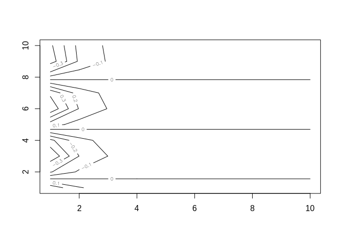<!-- -->

```r
"contour(x,y,f,nlevels=45,add=T)
fa=(f-t(f))/2
contour (x,y,fa,nlevels =15)"
```

```
## [1] "contour(x,y,f,nlevels=45,add=T)\nfa=(f-t(f))/2\ncontour (x,y,fa,nlevels =15)"
```

```r
x = seq(1,1000)
y = x
f = outer(x,y,function(x,y)cos(y)/(1+x^2))
image(x,y,f) #produce a heatmap
```

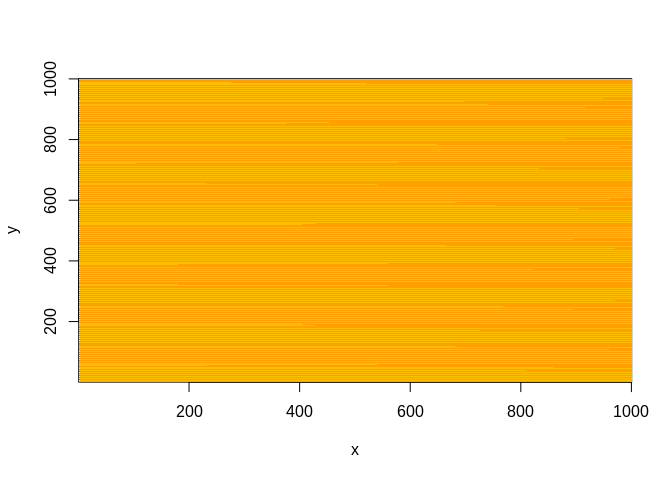<!-- -->

Plotting a three-dimensional plot

```r
x = seq(1,100)
y = x
f = outer(x,y,function(x,y)cos(y)/(1+x^2))
persp(x,y,f,theta=30,phi=30) #theta and phi control the angles at which the plot is viewed
```

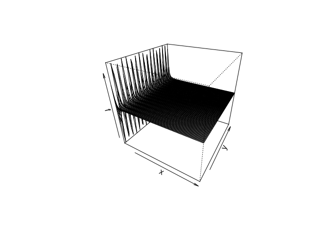<!-- -->

Indexing Data

```r
A = matrix(1:16,4,4)
A[2,3]
```

```
## [1] 10
```


```r
A[c(1,3),c(2,4)]  #slicing a matrix
```

```
##      [,1] [,2]
## [1,]    5   13
## [2,]    7   15
```

```r
A[1:3,2:4]  #Another way...
```

```
##      [,1] [,2] [,3]
## [1,]    5    9   13
## [2,]    6   10   14
## [3,]    7   11   15
```

```r
A[1:2,]
```

```
##      [,1] [,2] [,3] [,4]
## [1,]    1    5    9   13
## [2,]    2    6   10   14
```

```r
A[,1:2]
```

```
##      [,1] [,2]
## [1,]    1    5
## [2,]    2    6
## [3,]    3    7
## [4,]    4    8
```

```r
A[-c(1,3),]  #don't consider rows 1 and 3
```

```
##      [,1] [,2] [,3] [,4]
## [1,]    2    6   10   14
## [2,]    4    8   12   16
```

```r
dim(A) #shape of the matrix (rows, columns)
```

```
## [1] 4 4
```
Loading Data

```r
library(ISLR) #-->installing a library
library(MASS)
Auto[1:5,] #this dataset is already present when we installed ISLR library
```

```
##   mpg cylinders displacement horsepower weight acceleration year origin
## 1  18         8          307        130   3504         12.0   70      1
## 2  15         8          350        165   3693         11.5   70      1
## 3  18         8          318        150   3436         11.0   70      1
## 4  16         8          304        150   3433         12.0   70      1
## 5  17         8          302        140   3449         10.5   70      1
##                        name
## 1 chevrolet chevelle malibu
## 2         buick skylark 320
## 3        plymouth satellite
## 4             amc rebel sst
## 5               ford torino
```

```r
names(Auto) #to see columns name
```

```
## [1] "mpg"          "cylinders"    "displacement" "horsepower"   "weight"      
## [6] "acceleration" "year"         "origin"       "name"
```

Additional Graphical and Numerical Summaries

```r
plot(Auto$cylinders,Auto$mpg)
```

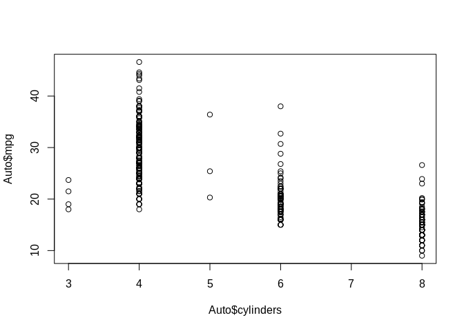<!-- -->

```r
#attach(Auto) so we can do:
#plot(cylinders,mpg)
#remember!!!: detach(Auto)
```

```r
Auto$cylinders=as.factor(Auto$cylinders)  #transform Auto from numeric to categorical (qualitative var)
```

```r
plot(Auto$cylinders,Auto$mpg)  #boxplot is printed if  i have categorical variable on x-axis
```

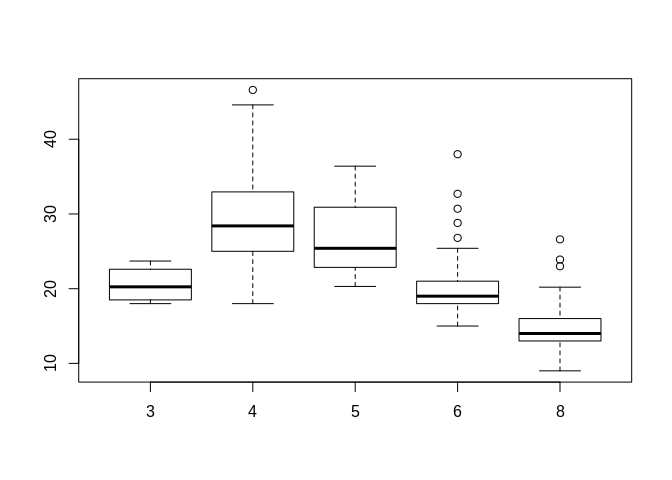<!-- -->

```r
hist(Auto$mpg[Auto$cylinders=="4"])  #Added a filter to histogram
```

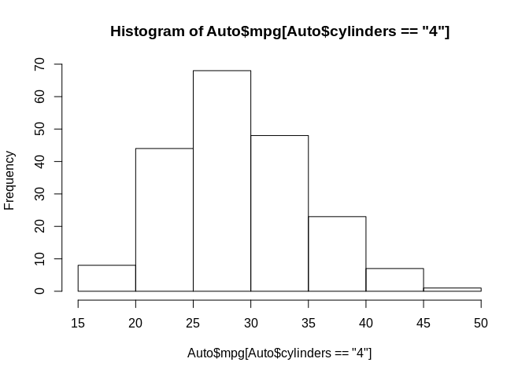<!-- -->

```r
pairs( ~mpg + cylinders + horsepower,Auto)  #produce a scatterplot among the combination of all features
```

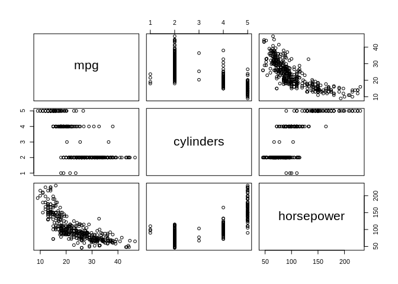<!-- -->

```r
summary(Auto) #a summary of Auto dataset
```

```
##       mpg        cylinders  displacement     horsepower        weight    
##  Min.   : 9.00   3:  4     Min.   : 68.0   Min.   : 46.0   Min.   :1613  
##  1st Qu.:17.00   4:199     1st Qu.:105.0   1st Qu.: 75.0   1st Qu.:2225  
##  Median :22.75   5:  3     Median :151.0   Median : 93.5   Median :2804  
##  Mean   :23.45   6: 83     Mean   :194.4   Mean   :104.5   Mean   :2978  
##  3rd Qu.:29.00   8:103     3rd Qu.:275.8   3rd Qu.:126.0   3rd Qu.:3615  
##  Max.   :46.60             Max.   :455.0   Max.   :230.0   Max.   :5140  
##                                                                          
##   acceleration        year           origin                      name    
##  Min.   : 8.00   Min.   :70.00   Min.   :1.000   amc matador       :  5  
##  1st Qu.:13.78   1st Qu.:73.00   1st Qu.:1.000   ford pinto        :  5  
##  Median :15.50   Median :76.00   Median :1.000   toyota corolla    :  5  
##  Mean   :15.54   Mean   :75.98   Mean   :1.577   amc gremlin       :  4  
##  3rd Qu.:17.02   3rd Qu.:79.00   3rd Qu.:2.000   amc hornet        :  4  
##  Max.   :24.80   Max.   :82.00   Max.   :3.000   chevrolet chevette:  4  
##                                                  (Other)           :365
```

```r
summary(Auto$weight) #summary of a single attribute
```

```
##    Min. 1st Qu.  Median    Mean 3rd Qu.    Max. 
##    1613    2225    2804    2978    3615    5140
```


```r
#savehistory()
#use loadhistory to load history next time
```
###########EXERCISES#############

```r
College[1:5,]
```

```
##                              Private Apps Accept Enroll Top10perc Top25perc
## Abilene Christian University     Yes 1660   1232    721        23        52
## Adelphi University               Yes 2186   1924    512        16        29
## Adrian College                   Yes 1428   1097    336        22        50
## Agnes Scott College              Yes  417    349    137        60        89
## Alaska Pacific University        Yes  193    146     55        16        44
##                              F.Undergrad P.Undergrad Outstate Room.Board Books
## Abilene Christian University        2885         537     7440       3300   450
## Adelphi University                  2683        1227    12280       6450   750
## Adrian College                      1036          99    11250       3750   400
## Agnes Scott College                  510          63    12960       5450   450
## Alaska Pacific University            249         869     7560       4120   800
##                              Personal PhD Terminal S.F.Ratio perc.alumni Expend
## Abilene Christian University     2200  70       78      18.1          12   7041
## Adelphi University               1500  29       30      12.2          16  10527
## Adrian College                   1165  53       66      12.9          30   8735
## Agnes Scott College               875  92       97       7.7          37  19016
## Alaska Pacific University        1500  76       72      11.9           2  10922
##                              Grad.Rate
## Abilene Christian University        60
## Adelphi University                  56
## Adrian College                      54
## Agnes Scott College                 59
## Alaska Pacific University           15
```

```r
names(College)
```

```
##  [1] "Private"     "Apps"        "Accept"      "Enroll"      "Top10perc"  
##  [6] "Top25perc"   "F.Undergrad" "P.Undergrad" "Outstate"    "Room.Board" 
## [11] "Books"       "Personal"    "PhD"         "Terminal"    "S.F.Ratio"  
## [16] "perc.alumni" "Expend"      "Grad.Rate"
```


```r
summary(College)
```

```
##  Private        Apps           Accept          Enroll       Top10perc    
##  No :212   Min.   :   81   Min.   :   72   Min.   :  35   Min.   : 1.00  
##  Yes:565   1st Qu.:  776   1st Qu.:  604   1st Qu.: 242   1st Qu.:15.00  
##            Median : 1558   Median : 1110   Median : 434   Median :23.00  
##            Mean   : 3002   Mean   : 2019   Mean   : 780   Mean   :27.56  
##            3rd Qu.: 3624   3rd Qu.: 2424   3rd Qu.: 902   3rd Qu.:35.00  
##            Max.   :48094   Max.   :26330   Max.   :6392   Max.   :96.00  
##    Top25perc      F.Undergrad     P.Undergrad         Outstate    
##  Min.   :  9.0   Min.   :  139   Min.   :    1.0   Min.   : 2340  
##  1st Qu.: 41.0   1st Qu.:  992   1st Qu.:   95.0   1st Qu.: 7320  
##  Median : 54.0   Median : 1707   Median :  353.0   Median : 9990  
##  Mean   : 55.8   Mean   : 3700   Mean   :  855.3   Mean   :10441  
##  3rd Qu.: 69.0   3rd Qu.: 4005   3rd Qu.:  967.0   3rd Qu.:12925  
##  Max.   :100.0   Max.   :31643   Max.   :21836.0   Max.   :21700  
##    Room.Board       Books           Personal         PhD        
##  Min.   :1780   Min.   :  96.0   Min.   : 250   Min.   :  8.00  
##  1st Qu.:3597   1st Qu.: 470.0   1st Qu.: 850   1st Qu.: 62.00  
##  Median :4200   Median : 500.0   Median :1200   Median : 75.00  
##  Mean   :4358   Mean   : 549.4   Mean   :1341   Mean   : 72.66  
##  3rd Qu.:5050   3rd Qu.: 600.0   3rd Qu.:1700   3rd Qu.: 85.00  
##  Max.   :8124   Max.   :2340.0   Max.   :6800   Max.   :103.00  
##     Terminal       S.F.Ratio      perc.alumni        Expend     
##  Min.   : 24.0   Min.   : 2.50   Min.   : 0.00   Min.   : 3186  
##  1st Qu.: 71.0   1st Qu.:11.50   1st Qu.:13.00   1st Qu.: 6751  
##  Median : 82.0   Median :13.60   Median :21.00   Median : 8377  
##  Mean   : 79.7   Mean   :14.09   Mean   :22.74   Mean   : 9660  
##  3rd Qu.: 92.0   3rd Qu.:16.50   3rd Qu.:31.00   3rd Qu.:10830  
##  Max.   :100.0   Max.   :39.80   Max.   :64.00   Max.   :56233  
##    Grad.Rate     
##  Min.   : 10.00  
##  1st Qu.: 53.00  
##  Median : 65.00  
##  Mean   : 65.46  
##  3rd Qu.: 78.00  
##  Max.   :118.00
```

```r
pairs(College[,1:10])  #scatterplot of first 10 features (columns)
```

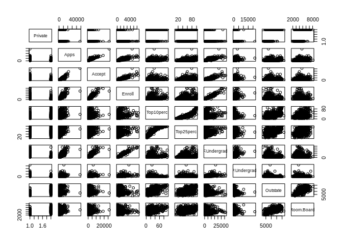<!-- -->

```r
plot(College$Outstate,College$Private)
```

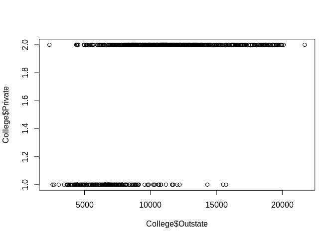<!-- -->

We want to create a qualitative variable [Yes/No] with college$Top10perc > or < 50

```r
Elite = rep("No",nrow(College))
Elite[College$Top10perc>50]="Yes"
Elite=as.factor(Elite)
College=data.frame(College,Elite)
```

```r
summary(College$Elite)
```

```
##  No Yes 
## 699  78
```

```r
par(mfrow=c(2,2)) #create a 2x2 plot
hist(College$Accept)
hist(College$Enroll)
hist(College$Top10perc)
hist(College$Top25perc)
```

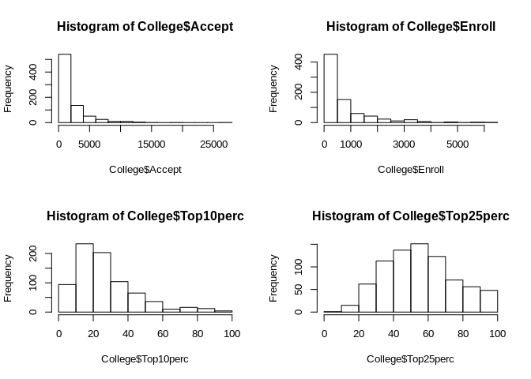<!-- -->

A function to set image size:

```r
Auto[1:5,]
```

```
##   mpg cylinders displacement horsepower weight acceleration year origin
## 1  18         8          307        130   3504         12.0   70      1
## 2  15         8          350        165   3693         11.5   70      1
## 3  18         8          318        150   3436         11.0   70      1
## 4  16         8          304        150   3433         12.0   70      1
## 5  17         8          302        140   3449         10.5   70      1
##                        name
## 1 chevrolet chevelle malibu
## 2         buick skylark 320
## 3        plymouth satellite
## 4             amc rebel sst
## 5               ford torino
```

Finding min/max of quantitative variables


```r
Auto1=na.omit(Auto) #removes rows with missing values
names(Auto1)
```

```
## [1] "mpg"          "cylinders"    "displacement" "horsepower"   "weight"      
## [6] "acceleration" "year"         "origin"       "name"
```


```r
range(Auto1$displacement)
```

```
## [1]  68 455
```

```r
range(Auto1$mpg)
```

```
## [1]  9.0 46.6
```

```r
range(Auto1$horsepower)
```

```
## [1]  46 230
```

```r
range(Auto1$weight)
```

```
## [1] 1613 5140
```

```r
range(Auto1$acceleration)
```

```
## [1]  8.0 24.8
```

```r
range(Auto1$year)
```

```
## [1] 70 82
```

```r
range(Auto1$origin)
```

```
## [1] 1 3
```

Mean and standard deviation of quantitative variables

```r
print("####Mean###")
```

```
## [1] "####Mean###"
```

```r
mean(Auto1$displacement)
```

```
## [1] 194.412
```

```r
mean(Auto1$mpg)
```

```
## [1] 23.44592
```

```r
mean(Auto1$horsepower)
```

```
## [1] 104.4694
```

```r
mean(Auto1$weight)
```

```
## [1] 2977.584
```

```r
mean(Auto1$acceleration)
```

```
## [1] 15.54133
```

```r
mean(Auto1$year)
```

```
## [1] 75.97959
```

```r
mean(Auto1$origin)
```

```
## [1] 1.576531
```

```r
print("####Variance:####")
```

```
## [1] "####Variance:####"
```

```r
sqrt(var(Auto1$displacement))
```

```
## [1] 104.644
```

```r
sqrt(var(Auto1$mpg))
```

```
## [1] 7.805007
```

```r
sqrt(var(Auto1$horsepower))
```

```
## [1] 38.49116
```

```r
sqrt(var(Auto1$weight))
```

```
## [1] 849.4026
```

```r
sqrt(var(Auto1$acceleration))
```

```
## [1] 2.758864
```

```r
sqrt(var(Auto1$year))
```

```
## [1] 3.683737
```

```r
sqrt(var(Auto1$origin))
```

```
## [1] 0.8055182
```

Slicing Auto dataset

```r
Auto2 = Auto[-c(rep(10:85)),]  #We remove from the dataset rows from 10 to 85
```
We recalculate Min/Max, Mean, Std

```r
print("####Min/Max####")
```

```
## [1] "####Min/Max####"
```

```r
range(Auto2$displacement)
```

```
## [1]  68 455
```

```r
range(Auto2$mpg)
```

```
## [1] 11.0 46.6
```

```r
range(Auto2$horsepower)
```

```
## [1]  46 230
```

```r
range(Auto2$weight)
```

```
## [1] 1649 4997
```

```r
range(Auto2$acceleration)
```

```
## [1]  8.5 24.8
```

```r
range(Auto2$year)
```

```
## [1] 70 82
```

```r
range(Auto2$origin)
```

```
## [1] 1 3
```

```r
print("####Mean###")
```

```
## [1] "####Mean###"
```

```r
mean(Auto2$displacement)
```

```
## [1] 187.2405
```

```r
mean(Auto2$mpg)
```

```
## [1] 24.40443
```

```r
mean(Auto2$horsepower)
```

```
## [1] 100.7215
```

```r
mean(Auto2$weight)
```

```
## [1] 2935.972
```

```r
mean(Auto2$acceleration)
```

```
## [1] 15.7269
```

```r
mean(Auto2$year)
```

```
## [1] 77.14557
```

```r
mean(Auto2$origin)
```

```
## [1] 1.601266
```

```r
print("####Variance:####")
```

```
## [1] "####Variance:####"
```

```r
sqrt(var(Auto2$displacement))
```

```
## [1] 99.67837
```

```r
sqrt(var(Auto2$mpg))
```

```
## [1] 7.867283
```

```r
sqrt(var(Auto2$horsepower))
```

```
## [1] 35.70885
```

```r
sqrt(var(Auto2$weight))
```

```
## [1] 811.3002
```

```r
sqrt(var(Auto2$acceleration))
```

```
## [1] 2.693721
```

```r
sqrt(var(Auto2$year))
```

```
## [1] 3.106217
```

```r
sqrt(var(Auto2$origin))
```

```
## [1] 0.81991
```
Plotting scatterplots for combination of different predictors(features)

```r
pairs(~ mpg + displacement + horsepower+ cylinders+weight +acceleration 
 , Auto2)
```

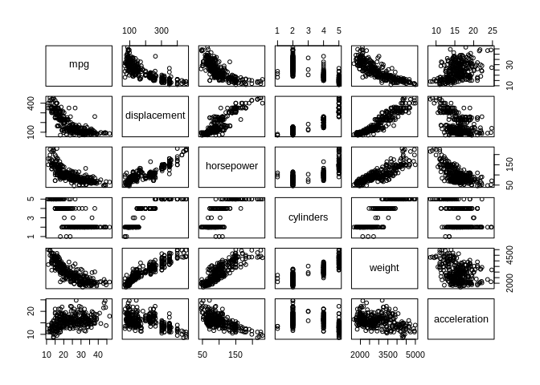<!-- -->

Exercise on Boston dataset

```r
Boston[1:5,]
```

```
##      crim zn indus chas   nox    rm  age    dis rad tax ptratio  black lstat
## 1 0.00632 18  2.31    0 0.538 6.575 65.2 4.0900   1 296    15.3 396.90  4.98
## 2 0.02731  0  7.07    0 0.469 6.421 78.9 4.9671   2 242    17.8 396.90  9.14
## 3 0.02729  0  7.07    0 0.469 7.185 61.1 4.9671   2 242    17.8 392.83  4.03
## 4 0.03237  0  2.18    0 0.458 6.998 45.8 6.0622   3 222    18.7 394.63  2.94
## 5 0.06905  0  2.18    0 0.458 7.147 54.2 6.0622   3 222    18.7 396.90  5.33
##   medv
## 1 24.0
## 2 21.6
## 3 34.7
## 4 33.4
## 5 36.2
```

```r
??Boston #To have infos about this dataset (columns' description)
```

```r
dim(Boston) #dimensions of our dataset
```

```
## [1] 506  14
```

```r
pairs(Boston[,1:10])
```

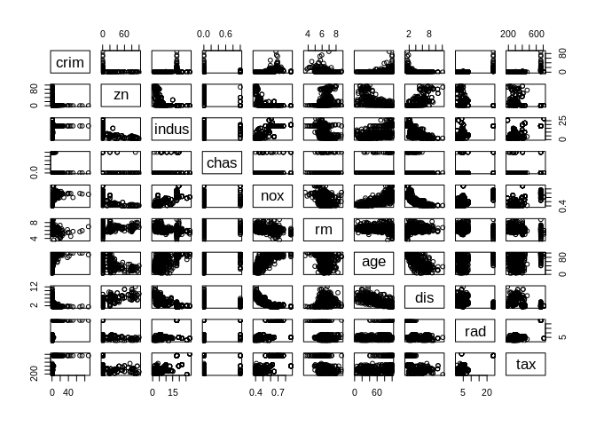<!-- -->

Focus on some specific variables...

```r
pairs(~crim+age+dis,Boston)
```

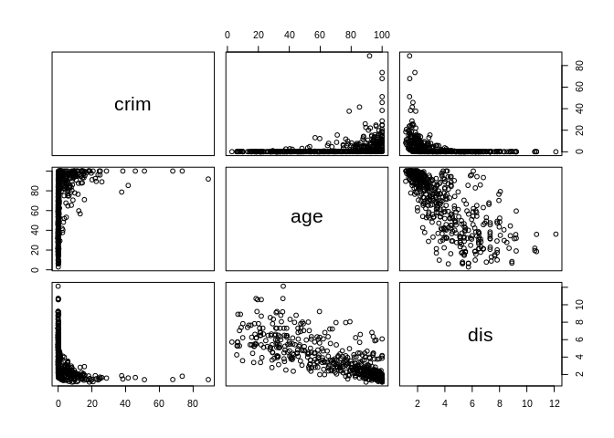<!-- -->

```r
Boston=na.omit(Boston) #removes rows with missing values
```

```r
print("####Min/Max####")
```

```
## [1] "####Min/Max####"
```

```r
range(Boston$crim)
```

```
## [1]  0.00632 88.97620
```

```r
#range(Boston$Tax)
range(Boston$ptratio)
```

```
## [1] 12.6 22.0
```

```r
Boston$age[Boston$chas == "1"] #we have 35 rows with chas =1!!!
```

```
##  [1] 100.0  88.0  96.0  82.6  92.6  98.2  93.9  59.1 100.0  92.1  88.6  53.8
## [13]  56.0  93.8  92.4  88.5  91.3  77.7  66.5  76.5  61.5  51.8  32.9  49.0
## [25]  27.6  49.7  24.8  97.4  91.0  83.4  89.0  82.9  96.8  97.5  89.6
```

```r
summary(Boston$ptratio)
```

```
##    Min. 1st Qu.  Median    Mean 3rd Qu.    Max. 
##   12.60   17.40   19.05   18.46   20.20   22.00
```

```r
Boston[1:5,]
```

```
##      crim zn indus chas   nox    rm  age    dis rad tax ptratio  black lstat
## 1 0.00632 18  2.31    0 0.538 6.575 65.2 4.0900   1 296    15.3 396.90  4.98
## 2 0.02731  0  7.07    0 0.469 6.421 78.9 4.9671   2 242    17.8 396.90  9.14
## 3 0.02729  0  7.07    0 0.469 7.185 61.1 4.9671   2 242    17.8 392.83  4.03
## 4 0.03237  0  2.18    0 0.458 6.998 45.8 6.0622   3 222    18.7 394.63  2.94
## 5 0.06905  0  2.18    0 0.458 7.147 54.2 6.0622   3 222    18.7 396.90  5.33
##   medv
## 1 24.0
## 2 21.6
## 3 34.7
## 4 33.4
## 5 36.2
```

```r
subset(Boston,medv == min(medv)) #rows(suburbs) with lowest medv
```

```
##        crim zn indus chas   nox    rm age    dis rad tax ptratio  black lstat
## 399 38.3518  0  18.1    0 0.693 5.453 100 1.4896  24 666    20.2 396.90 30.59
## 406 67.9208  0  18.1    0 0.693 5.683 100 1.4254  24 666    20.2 384.97 22.98
##     medv
## 399    5
## 406    5
```

```r
print("####Min/Max####")
```

```
## [1] "####Min/Max####"
```

```r
range(Boston$crim)
```

```
## [1]  0.00632 88.97620
```

```r
#range(Boston$Tax)
range(Boston$ptratio)
```

```
## [1] 12.6 22.0
```

```r
range(Boston$nox)
```

```
## [1] 0.385 0.871
```

```r
subset(Boston[1:15,],rm > 7)  #We have 64 suburbs with avg more than 7 rooms per dwelling (dimora)
```

```
##      crim zn indus chas   nox    rm  age    dis rad tax ptratio  black lstat
## 3 0.02729  0  7.07    0 0.469 7.185 61.1 4.9671   2 242    17.8 392.83  4.03
## 5 0.06905  0  2.18    0 0.458 7.147 54.2 6.0622   3 222    18.7 396.90  5.33
##   medv
## 3 34.7
## 5 36.2
```

```r
subset(Boston[1:15,],rm > 8)  #We have 13 suburbs with avg more than 8 rooms per dwelling (dimora)
```

```
##  [1] crim    zn      indus   chas    nox     rm      age     dis     rad    
## [10] tax     ptratio black   lstat   medv   
## <0 rows> (or 0-length row.names)
```
With this scenario (rm>8), we have;
-High percentage of old houses, build before 1940 (age var high!!!)
-Very low crime rate!!! (crim var)
