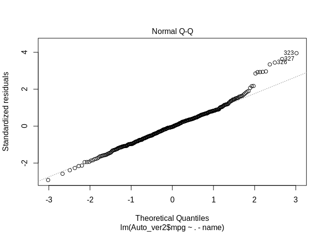
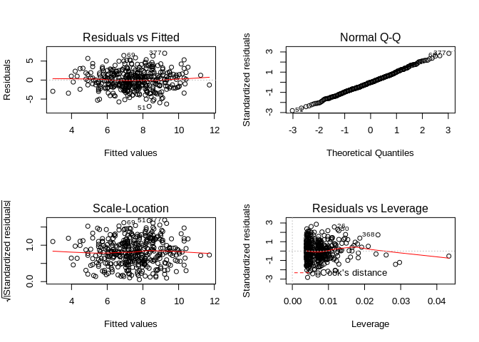

```r
knitr::opts_chunk$set(message=FALSE,warning=FALSE,fig.path = "README_figs/README-" ) 
```
Library function --> used to load libraries, groups of functions that are not included in base R distribution --> we need to use library() function must be called each time to use a given package


```r
library(MASS)  #very large dataset of collection of datasets and functions
library(ISLR)  #it includes datasets associated with ISLR book
```
SIMPLE LINEAR REGRESSION

```r
?Boston #Infos about Boston dataset

Boston[1:5,] #This dataset contains for each example a specific neighborhoods of Boston
```

```
##      crim zn indus chas   nox    rm  age    dis rad tax ptratio  black lstat
## 1 0.00632 18  2.31    0 0.538 6.575 65.2 4.0900   1 296    15.3 396.90  4.98
## 2 0.02731  0  7.07    0 0.469 6.421 78.9 4.9671   2 242    17.8 396.90  9.14
## 3 0.02729  0  7.07    0 0.469 7.185 61.1 4.9671   2 242    17.8 392.83  4.03
## 4 0.03237  0  2.18    0 0.458 6.998 45.8 6.0622   3 222    18.7 394.63  2.94
## 5 0.06905  0  2.18    0 0.458 7.147 54.2 6.0622   3 222    18.7 396.90  5.33
##   medv
## 1 24.0
## 2 21.6
## 3 34.7
## 4 33.4
## 5 36.2
```

```r
names(Boston) #The columns names of our dataset Boston
```

```
##  [1] "crim"    "zn"      "indus"   "chas"    "nox"     "rm"      "age"    
##  [8] "dis"     "rad"     "tax"     "ptratio" "black"   "lstat"   "medv"
```

```r
lm.fit = lm(medv~lstat,data=Boston)  #Simple linear regression. medv=Responce, lstat=Predictor 

summary(lm.fit) #Statistical infos about the simple linear regression
```

```
## 
## Call:
## lm(formula = medv ~ lstat, data = Boston)
## 
## Residuals:
##     Min      1Q  Median      3Q     Max 
## -15.168  -3.990  -1.318   2.034  24.500 
## 
## Coefficients:
##             Estimate Std. Error t value Pr(>|t|)    
## (Intercept) 34.55384    0.56263   61.41   <2e-16 ***
## lstat       -0.95005    0.03873  -24.53   <2e-16 ***
## ---
## Signif. codes:  0 '***' 0.001 '**' 0.01 '*' 0.05 '.' 0.1 ' ' 1
## 
## Residual standard error: 6.216 on 504 degrees of freedom
## Multiple R-squared:  0.5441,	Adjusted R-squared:  0.5432 
## F-statistic: 601.6 on 1 and 504 DF,  p-value: < 2.2e-16
```

```r
names(lm.fit) #lm.fit is an object. In this way we have a list of all methods. Example: lm.fit$coefficients
```

```
##  [1] "coefficients"  "residuals"     "effects"       "rank"         
##  [5] "fitted.values" "assign"        "qr"            "df.residual"  
##  [9] "xlevels"       "call"          "terms"         "model"
```

```r
coef(lm.fit)  #Another way to see the Beta coefficients
```

```
## (Intercept)       lstat 
##  34.5538409  -0.9500494
```

```r
confint(lm.fit) #confidence interval
```

```
##                 2.5 %     97.5 %
## (Intercept) 33.448457 35.6592247
## lstat       -1.026148 -0.8739505
```

```r
predict(lm.fit,data.frame(lstat=c(5,10,15)),interval="confidence")
```

```
##        fit      lwr      upr
## 1 29.80359 29.00741 30.59978
## 2 25.05335 24.47413 25.63256
## 3 20.30310 19.73159 20.87461
```

```r
#Confidence interval for some responce values (according to some values of the predictor-->lstat)
```

```r
predict(lm.fit,data.frame(lstat=c(5,10,15)),interval="prediction")
```

```
##        fit       lwr      upr
## 1 29.80359 17.565675 42.04151
## 2 25.05335 12.827626 37.27907
## 3 20.30310  8.077742 32.52846
```

```r
#Confidence interval for some responce values (according to some values of the predictor-->lstat)
```

```r
#attach(Boston) In this way we can use directly the column name and not Dataset$ColumnName
plot(Boston$lstat,Boston$medv)
abline(lm.fit,lwd=3,col="red")
```

<!-- -->

```r
par(mfrow=c(2,2)) #If we want to print for graph at the same time
plot(lm.fit)
```

<!-- -->

```r
plot(predict(lm.fit),residuals(lm.fit)) #Equivalent to first plot in previous 2x2 plot
```

<!-- -->


```r
plot(predict(lm.fit),rstudent(lm.fit)) #Predictions vsStudentized residual 
```

<!-- -->

```r
plot(hatvalues (lm.fit ))  #hatvalues() calculates leverages statistics
```

<!-- -->

```r
which.max(hatvalues(lm.fit)) #identifies the index with highest leverage
```

```
## 375 
## 375
```

Multiple Linear Regression


```r
lm.fit=lm(medv~lstat+age,data=Boston)
summary(lm.fit)
```

```
## 
## Call:
## lm(formula = medv ~ lstat + age, data = Boston)
## 
## Residuals:
##     Min      1Q  Median      3Q     Max 
## -15.981  -3.978  -1.283   1.968  23.158 
## 
## Coefficients:
##             Estimate Std. Error t value Pr(>|t|)    
## (Intercept) 33.22276    0.73085  45.458  < 2e-16 ***
## lstat       -1.03207    0.04819 -21.416  < 2e-16 ***
## age          0.03454    0.01223   2.826  0.00491 ** 
## ---
## Signif. codes:  0 '***' 0.001 '**' 0.01 '*' 0.05 '.' 0.1 ' ' 1
## 
## Residual standard error: 6.173 on 503 degrees of freedom
## Multiple R-squared:  0.5513,	Adjusted R-squared:  0.5495 
## F-statistic:   309 on 2 and 503 DF,  p-value: < 2.2e-16
```

```r
lm.fit=lm(medv~.,data=Boston)  #We use all predictor in the dataset in one time. Remember 3.46e+01 = 3.46*10^1
summary(lm.fit)
```

```
## 
## Call:
## lm(formula = medv ~ ., data = Boston)
## 
## Residuals:
##     Min      1Q  Median      3Q     Max 
## -15.595  -2.730  -0.518   1.777  26.199 
## 
## Coefficients:
##               Estimate Std. Error t value Pr(>|t|)    
## (Intercept)  3.646e+01  5.103e+00   7.144 3.28e-12 ***
## crim        -1.080e-01  3.286e-02  -3.287 0.001087 ** 
## zn           4.642e-02  1.373e-02   3.382 0.000778 ***
## indus        2.056e-02  6.150e-02   0.334 0.738288    
## chas         2.687e+00  8.616e-01   3.118 0.001925 ** 
## nox         -1.777e+01  3.820e+00  -4.651 4.25e-06 ***
## rm           3.810e+00  4.179e-01   9.116  < 2e-16 ***
## age          6.922e-04  1.321e-02   0.052 0.958229    
## dis         -1.476e+00  1.995e-01  -7.398 6.01e-13 ***
## rad          3.060e-01  6.635e-02   4.613 5.07e-06 ***
## tax         -1.233e-02  3.760e-03  -3.280 0.001112 ** 
## ptratio     -9.527e-01  1.308e-01  -7.283 1.31e-12 ***
## black        9.312e-03  2.686e-03   3.467 0.000573 ***
## lstat       -5.248e-01  5.072e-02 -10.347  < 2e-16 ***
## ---
## Signif. codes:  0 '***' 0.001 '**' 0.01 '*' 0.05 '.' 0.1 ' ' 1
## 
## Residual standard error: 4.745 on 492 degrees of freedom
## Multiple R-squared:  0.7406,	Adjusted R-squared:  0.7338 
## F-statistic: 108.1 on 13 and 492 DF,  p-value: < 2.2e-16
```

```r
summary(lm.fit)$r.sq  #Gives R^2
```

```
## [1] 0.7406427
```

```r
summary(lm.fit)$sigma #Gives RSE
```

```
## [1] 4.745298
```

```r
lm.fit1=lm(medv~.-age,data=Boston) #Consider all vars except age (predictor with highest pv-value)
#alternative, we can use: lm.fit1=update(lm.fit,~.-age)
summary(lm.fit1)
```

```
## 
## Call:
## lm(formula = medv ~ . - age, data = Boston)
## 
## Residuals:
##      Min       1Q   Median       3Q      Max 
## -15.6054  -2.7313  -0.5188   1.7601  26.2243 
## 
## Coefficients:
##               Estimate Std. Error t value Pr(>|t|)    
## (Intercept)  36.436927   5.080119   7.172 2.72e-12 ***
## crim         -0.108006   0.032832  -3.290 0.001075 ** 
## zn            0.046334   0.013613   3.404 0.000719 ***
## indus         0.020562   0.061433   0.335 0.737989    
## chas          2.689026   0.859598   3.128 0.001863 ** 
## nox         -17.713540   3.679308  -4.814 1.97e-06 ***
## rm            3.814394   0.408480   9.338  < 2e-16 ***
## dis          -1.478612   0.190611  -7.757 5.03e-14 ***
## rad           0.305786   0.066089   4.627 4.75e-06 ***
## tax          -0.012329   0.003755  -3.283 0.001099 ** 
## ptratio      -0.952211   0.130294  -7.308 1.10e-12 ***
## black         0.009321   0.002678   3.481 0.000544 ***
## lstat        -0.523852   0.047625 -10.999  < 2e-16 ***
## ---
## Signif. codes:  0 '***' 0.001 '**' 0.01 '*' 0.05 '.' 0.1 ' ' 1
## 
## Residual standard error: 4.74 on 493 degrees of freedom
## Multiple R-squared:  0.7406,	Adjusted R-squared:  0.7343 
## F-statistic: 117.3 on 12 and 493 DF,  p-value: < 2.2e-16
```
Non-linear Transformation of the predictors


```r
lm.fit2=lm(medv~lstat+I(lstat^2),data=Boston) #I() function allows to do lstat^2
summary(lm.fit2)
```

```
## 
## Call:
## lm(formula = medv ~ lstat + I(lstat^2), data = Boston)
## 
## Residuals:
##      Min       1Q   Median       3Q      Max 
## -15.2834  -3.8313  -0.5295   2.3095  25.4148 
## 
## Coefficients:
##              Estimate Std. Error t value Pr(>|t|)    
## (Intercept) 42.862007   0.872084   49.15   <2e-16 ***
## lstat       -2.332821   0.123803  -18.84   <2e-16 ***
## I(lstat^2)   0.043547   0.003745   11.63   <2e-16 ***
## ---
## Signif. codes:  0 '***' 0.001 '**' 0.01 '*' 0.05 '.' 0.1 ' ' 1
## 
## Residual standard error: 5.524 on 503 degrees of freedom
## Multiple R-squared:  0.6407,	Adjusted R-squared:  0.6393 
## F-statistic: 448.5 on 2 and 503 DF,  p-value: < 2.2e-16
```

```r
lm.fit=lm(medv~lstat,data=Boston) #We do basic regression for comparing this model with non-linear predictor implementation
anova(lm.fit,lm.fit2) #We have null hypo: two models fit the data equally well, alternative hypo: model with quaratic function is better
```

```
## Analysis of Variance Table
## 
## Model 1: medv ~ lstat
## Model 2: medv ~ lstat + I(lstat^2)
##   Res.Df   RSS Df Sum of Sq     F    Pr(>F)    
## 1    504 19472                                 
## 2    503 15347  1    4125.1 135.2 < 2.2e-16 ***
## ---
## Signif. codes:  0 '***' 0.001 '**' 0.01 '*' 0.05 '.' 0.1 ' ' 1
```

```r
#from ANOVA--alternative hypo is better!!!
```

```r
lm.fit5 = lm(medv~poly(lstat,5),data=Boston) #a simply method to implement a 5° grade polinomio
summary(lm.fit5)   #High performance!
```

```
## 
## Call:
## lm(formula = medv ~ poly(lstat, 5), data = Boston)
## 
## Residuals:
##      Min       1Q   Median       3Q      Max 
## -13.5433  -3.1039  -0.7052   2.0844  27.1153 
## 
## Coefficients:
##                  Estimate Std. Error t value Pr(>|t|)    
## (Intercept)       22.5328     0.2318  97.197  < 2e-16 ***
## poly(lstat, 5)1 -152.4595     5.2148 -29.236  < 2e-16 ***
## poly(lstat, 5)2   64.2272     5.2148  12.316  < 2e-16 ***
## poly(lstat, 5)3  -27.0511     5.2148  -5.187 3.10e-07 ***
## poly(lstat, 5)4   25.4517     5.2148   4.881 1.42e-06 ***
## poly(lstat, 5)5  -19.2524     5.2148  -3.692 0.000247 ***
## ---
## Signif. codes:  0 '***' 0.001 '**' 0.01 '*' 0.05 '.' 0.1 ' ' 1
## 
## Residual standard error: 5.215 on 500 degrees of freedom
## Multiple R-squared:  0.6817,	Adjusted R-squared:  0.6785 
## F-statistic: 214.2 on 5 and 500 DF,  p-value: < 2.2e-16
```

```r
names(Boston)
```

```
##  [1] "crim"    "zn"      "indus"   "chas"    "nox"     "rm"      "age"    
##  [8] "dis"     "rad"     "tax"     "ptratio" "black"   "lstat"   "medv"
```

```r
summary(lm(medv~log(rm),data=Boston)) #We convert a predictor (rm) to log value and we obtain great performances!!!
```

```
## 
## Call:
## lm(formula = medv ~ log(rm), data = Boston)
## 
## Residuals:
##     Min      1Q  Median      3Q     Max 
## -19.487  -2.875  -0.104   2.837  39.816 
## 
## Coefficients:
##             Estimate Std. Error t value Pr(>|t|)    
## (Intercept)  -76.488      5.028  -15.21   <2e-16 ***
## log(rm)       54.055      2.739   19.73   <2e-16 ***
## ---
## Signif. codes:  0 '***' 0.001 '**' 0.01 '*' 0.05 '.' 0.1 ' ' 1
## 
## Residual standard error: 6.915 on 504 degrees of freedom
## Multiple R-squared:  0.4358,	Adjusted R-squared:  0.4347 
## F-statistic: 389.3 on 1 and 504 DF,  p-value: < 2.2e-16
```
Qualitative Predictors


```r
Carseats[1:5,]
```

```
##   Sales CompPrice Income Advertising Population Price ShelveLoc Age Education
## 1  9.50       138     73          11        276   120       Bad  42        17
## 2 11.22       111     48          16        260    83      Good  65        10
## 3 10.06       113     35          10        269    80    Medium  59        12
## 4  7.40       117    100           4        466    97    Medium  55        14
## 5  4.15       141     64           3        340   128       Bad  38        13
##   Urban  US
## 1   Yes Yes
## 2   Yes Yes
## 3   Yes Yes
## 4   Yes Yes
## 5   Yes  No
```

```r
names(Carseats)
```

```
##  [1] "Sales"       "CompPrice"   "Income"      "Advertising" "Population" 
##  [6] "Price"       "ShelveLoc"   "Age"         "Education"   "Urban"      
## [11] "US"
```
We have a qualitative(level) variable -->Shelveloc (Bad/Medium/Good): indicator of the quality of the shelving location: the space within a store in which the car seat is displayed (at each location).

```r
lm.fit=lm(Sales~.+Income:Advertising+Price:Age,data=Carseats)
#Qualitative variable are automatically transformed in dummy variables
#Some interaction terms are created
#ShelveLocGood and ShelveLocMedium have good P-values-->good Shelve position in a store has positive increasing on the Sales
summary(lm.fit)
```

```
## 
## Call:
## lm(formula = Sales ~ . + Income:Advertising + Price:Age, data = Carseats)
## 
## Residuals:
##     Min      1Q  Median      3Q     Max 
## -2.9208 -0.7503  0.0177  0.6754  3.3413 
## 
## Coefficients:
##                      Estimate Std. Error t value Pr(>|t|)    
## (Intercept)         6.5755654  1.0087470   6.519 2.22e-10 ***
## CompPrice           0.0929371  0.0041183  22.567  < 2e-16 ***
## Income              0.0108940  0.0026044   4.183 3.57e-05 ***
## Advertising         0.0702462  0.0226091   3.107 0.002030 ** 
## Population          0.0001592  0.0003679   0.433 0.665330    
## Price              -0.1008064  0.0074399 -13.549  < 2e-16 ***
## ShelveLocGood       4.8486762  0.1528378  31.724  < 2e-16 ***
## ShelveLocMedium     1.9532620  0.1257682  15.531  < 2e-16 ***
## Age                -0.0579466  0.0159506  -3.633 0.000318 ***
## Education          -0.0208525  0.0196131  -1.063 0.288361    
## UrbanYes            0.1401597  0.1124019   1.247 0.213171    
## USYes              -0.1575571  0.1489234  -1.058 0.290729    
## Income:Advertising  0.0007510  0.0002784   2.698 0.007290 ** 
## Price:Age           0.0001068  0.0001333   0.801 0.423812    
## ---
## Signif. codes:  0 '***' 0.001 '**' 0.01 '*' 0.05 '.' 0.1 ' ' 1
## 
## Residual standard error: 1.011 on 386 degrees of freedom
## Multiple R-squared:  0.8761,	Adjusted R-squared:  0.8719 
## F-statistic:   210 on 13 and 386 DF,  p-value: < 2.2e-16
```

```r
#VERY USEFUL ABOUT DUMMY VARIABLE!!!
contrasts(Carseats$ShelveLoc)  #Qualitative variable-->dummy variable
```

```
##        Good Medium
## Bad       0      0
## Good      1      0
## Medium    0      1
```
WRITING FUNCTION:


```r
#In this way we can load the libraries with one function!!!
LoadLibraries=function(){
library(ISLR)
library(MASS)
print ("The libraries have been loaded")
}
```

EXERCISES DEVELOPTED BY MY OWN


```r
Auto[1:5,]
```

```
##   mpg cylinders displacement horsepower weight acceleration year origin
## 1  18         8          307        130   3504         12.0   70      1
## 2  15         8          350        165   3693         11.5   70      1
## 3  18         8          318        150   3436         11.0   70      1
## 4  16         8          304        150   3433         12.0   70      1
## 5  17         8          302        140   3449         10.5   70      1
##                        name
## 1 chevrolet chevelle malibu
## 2         buick skylark 320
## 3        plymouth satellite
## 4             amc rebel sst
## 5               ford torino
```

```r
lm.fit1 = lm(mpg~horsepower,data=Auto)
summary(lm.fit1)
```

```
## 
## Call:
## lm(formula = mpg ~ horsepower, data = Auto)
## 
## Residuals:
##      Min       1Q   Median       3Q      Max 
## -13.5710  -3.2592  -0.3435   2.7630  16.9240 
## 
## Coefficients:
##              Estimate Std. Error t value Pr(>|t|)    
## (Intercept) 39.935861   0.717499   55.66   <2e-16 ***
## horsepower  -0.157845   0.006446  -24.49   <2e-16 ***
## ---
## Signif. codes:  0 '***' 0.001 '**' 0.01 '*' 0.05 '.' 0.1 ' ' 1
## 
## Residual standard error: 4.906 on 390 degrees of freedom
## Multiple R-squared:  0.6059,	Adjusted R-squared:  0.6049 
## F-statistic: 599.7 on 1 and 390 DF,  p-value: < 2.2e-16
```
1-Is there a relation between the predictor and the response?
 -Yes (low P-value!)
2-How strong is the relationship between the predictor and the   
  response?
 -BY increasing the horsepower of 1 horse, the consumption   
  decreases, on avarage, of 0.15 miles-->quite weak relation
3-Is the relationship between the predictor and the response 
  positive or negative ? Negative
4-What is the predicted mpg associated with horsepower of 98? What 
  are the associated 95% confidence and prediction intervals?

```r
print("Predicted value with confidence interval")
```

```
## [1] "Predicted value with confidence interval"
```

```r
predict(lm.fit1,data.frame(horsepower=98),interval="confidence")
```

```
##        fit      lwr      upr
## 1 24.46708 23.97308 24.96108
```

```r
print("Predicted value with prediction interval")
```

```
## [1] "Predicted value with prediction interval"
```

```r
predict(lm.fit1,data.frame(horsepower=98),interval="prediction")
```

```
##        fit     lwr      upr
## 1 24.46708 14.8094 34.12476
```
5-Use the plot() function and abline() function to produce linear regression and predictor/response data (diagnostic plot)

```r
plot(Auto$horsepower,Auto$mpg)
abline(lm.fit1,lwd=3,col="red")
```

<!-- -->

```r
#The linear regression doesn't capture the predictor/responce very well(quite high RSE and min/max residual-->maybe non linear relation ???)
```

```r
plot(Auto) 
```

<!-- -->

From the plot of all vars we find a qualitative variable (name). We plot the correlation matrix excluding this variable.


```r
sapply(Auto,class) #We need to convert cylinders from factor to number
```

```
##          mpg    cylinders displacement   horsepower       weight acceleration 
##    "numeric"    "numeric"    "numeric"    "numeric"    "numeric"    "numeric" 
##         year       origin         name 
##    "numeric"    "numeric"     "factor"
```

```r
Auto_ver2 <- transform(Auto, cylinders = as.numeric(cylinders))
sapply(Auto_ver2,class)
```

```
##          mpg    cylinders displacement   horsepower       weight acceleration 
##    "numeric"    "numeric"    "numeric"    "numeric"    "numeric"    "numeric" 
##         year       origin         name 
##    "numeric"    "numeric"     "factor"
```

```r
library(corrplot)
corrplot(cor(Auto_ver2[,1:8]),method = "number",type = "upper") # show only upper side
```

<!-- -->

```r
lr_Auto = lm(Auto_ver2$mpg~.-name,data=Auto)
summary(lr_Auto)
```

```
## 
## Call:
## lm(formula = Auto_ver2$mpg ~ . - name, data = Auto)
## 
## Residuals:
##     Min      1Q  Median      3Q     Max 
## -9.5903 -2.1565 -0.1169  1.8690 13.0604 
## 
## Coefficients:
##                Estimate Std. Error t value Pr(>|t|)    
## (Intercept)  -17.218435   4.644294  -3.707  0.00024 ***
## cylinders     -0.493376   0.323282  -1.526  0.12780    
## displacement   0.019896   0.007515   2.647  0.00844 ** 
## horsepower    -0.016951   0.013787  -1.230  0.21963    
## weight        -0.006474   0.000652  -9.929  < 2e-16 ***
## acceleration   0.080576   0.098845   0.815  0.41548    
## year           0.750773   0.050973  14.729  < 2e-16 ***
## origin         1.426141   0.278136   5.127 4.67e-07 ***
## ---
## Signif. codes:  0 '***' 0.001 '**' 0.01 '*' 0.05 '.' 0.1 ' ' 1
## 
## Residual standard error: 3.328 on 384 degrees of freedom
## Multiple R-squared:  0.8215,	Adjusted R-squared:  0.8182 
## F-statistic: 252.4 on 7 and 384 DF,  p-value: < 2.2e-16
```
Is there a relationship between the predictors and the response?
Which predictors appear to have a statistically significant relationship   to the response?
There are many variables statistically significant (low p-value--> <1%) ##Intercept,Cylinders (4/5),Horsepower,Weight,Year,Origin##
What does the coefficient for the year variable suggest?
If we icrease by 1 year, on average, the mpg decreaes by 0.261 mpg/gallon.

```r
#Use the plot() function to produce diagnostic plots of the least squares regression fit. Comment on any problems you see with the fit
plot(lr_Auto)
```

<!-- --><!-- --><!-- --><!-- -->

From residual we can use our linear model and not a non-linear model (residuals are closed to y=0 line).
We have some instances with high residual vs fittet value (Outlier)-->387,327,323 and others (Standardize residual >3 we classified an outlier). SR(Standardize residual) = 2 -->We have residuals!!
We have an istance with high std residuals and high leverage!!--> 328

Remember: points with high residuals (outliers) don't affect linear regression shape but the RSE (Residual Sum of Error). Point with high leverage affect the linear regression shape. Points with high residuals and leverage are the worst!!!


```r
#We fit a model with some iteration terms

lm.iteractions = lm(Auto_ver2$mpg~.-name +year*origin+year*weight+weight*origin,data=Auto)
summary(lm.iteractions)
```

```
## 
## Call:
## lm(formula = Auto_ver2$mpg ~ . - name + year * origin + year * 
##     weight + weight * origin, data = Auto)
## 
## Residuals:
##    Min     1Q Median     3Q    Max 
## -8.770 -1.889 -0.165  1.483 11.610 
## 
## Coefficients:
##                 Estimate Std. Error t value Pr(>|t|)    
## (Intercept)   -1.242e+02  2.259e+01  -5.500 6.99e-08 ***
## cylinders     -1.760e-01  3.067e-01  -0.574   0.5664    
## displacement   8.281e-03  7.508e-03   1.103   0.2708    
## horsepower    -2.574e-02  1.318e-02  -1.953   0.0516 .  
## weight         3.114e-02  5.661e-03   5.500 6.98e-08 ***
## acceleration   1.185e-01  9.244e-02   1.281   0.2008    
## year           2.112e+00  3.003e-01   7.035 9.31e-12 ***
## origin         6.845e+00  5.250e+00   1.304   0.1931    
## year:origin   -3.841e-02  6.983e-02  -0.550   0.5825    
## weight:year   -4.724e-04  7.816e-05  -6.044 3.59e-09 ***
## weight:origin -1.186e-03  5.539e-04  -2.142   0.0329 *  
## ---
## Signif. codes:  0 '***' 0.001 '**' 0.01 '*' 0.05 '.' 0.1 ' ' 1
## 
## Residual standard error: 3.069 on 381 degrees of freedom
## Multiple R-squared:  0.8494,	Adjusted R-squared:  0.8454 
## F-statistic: 214.8 on 10 and 381 DF,  p-value: < 2.2e-16
```

```r
#Iteration weight*year is statistically significant: if we increase year, increases the effectivness of weight on mpg (and viceversa with weight on year).
```

```r
#Try different trasformation pf the variables: log(X), squaredroot(X),X^2 etc..
lm.squared = lm(mpg~poly(weight,2)+year,data=Auto) #We add a second degree polinomio
summary(lm.squared)
```

```
## 
## Call:
## lm(formula = mpg ~ poly(weight, 2) + year, data = Auto)
## 
## Residuals:
##     Min      1Q  Median      3Q     Max 
## -9.4561 -1.7083 -0.1726  1.5192 13.1789 
## 
## Coefficients:
##                   Estimate Std. Error t value Pr(>|t|)    
## (Intercept)       -39.5357     3.3694  -11.73   <2e-16 ***
## poly(weight, 2)1 -109.7789     3.1917  -34.40   <2e-16 ***
## poly(weight, 2)2   32.0474     3.0688   10.44   <2e-16 ***
## year                0.8289     0.0443   18.71   <2e-16 ***
## ---
## Signif. codes:  0 '***' 0.001 '**' 0.01 '*' 0.05 '.' 0.1 ' ' 1
## 
## Residual standard error: 3.032 on 388 degrees of freedom
## Multiple R-squared:  0.8503,	Adjusted R-squared:  0.8491 
## F-statistic: 734.4 on 3 and 388 DF,  p-value: < 2.2e-16
```

```r
#It's a good idea doinga non-linear variable!!
#Good performance!!! : low RSE and R^2!!!
```

```r
#Try a highr non linear var!!

lm.squared5 = lm(mpg~poly(weight,5)+year,data=Auto)  #Fith degree polinomio is not a good idea!!
                                                     #No statistically significant over 3th degree!!
summary(lm.squared5)
```

```
## 
## Call:
## lm(formula = mpg ~ poly(weight, 5) + year, data = Auto)
## 
## Residuals:
##    Min     1Q Median     3Q    Max 
## -9.679 -1.772 -0.181  1.579 12.956 
## 
## Coefficients:
##                    Estimate Std. Error t value Pr(>|t|)    
## (Intercept)       -39.57826    3.37509 -11.727   <2e-16 ***
## poly(weight, 5)1 -109.76630    3.19470 -34.359   <2e-16 ***
## poly(weight, 5)2   32.05344    3.07151  10.436   <2e-16 ***
## poly(weight, 5)3   -1.31837    3.03554  -0.434    0.664    
## poly(weight, 5)4   -3.76646    3.03486  -1.241    0.215    
## poly(weight, 5)5    2.36956    3.03543   0.781    0.435    
## year                0.82949    0.04438  18.693   <2e-16 ***
## ---
## Signif. codes:  0 '***' 0.001 '**' 0.01 '*' 0.05 '.' 0.1 ' ' 1
## 
## Residual standard error: 3.034 on 385 degrees of freedom
## Multiple R-squared:  0.8512,	Adjusted R-squared:  0.8489 
## F-statistic:   367 on 6 and 385 DF,  p-value: < 2.2e-16
```
Now we try to transform X to log(X).

```r
lr_Auto_squared = lm(Auto_ver2$mpg~+year+I(weight^2),data=Auto)
summary(lr_Auto_squared)  #THis model gives a good performance!!!
```

```
## 
## Call:
## lm(formula = Auto_ver2$mpg ~ +year + I(weight^2), data = Auto)
## 
## Residuals:
##     Min      1Q  Median      3Q     Max 
## -9.2573 -2.7468 -0.1344  2.2691 15.0664 
## 
## Coefficients:
##               Estimate Std. Error t value Pr(>|t|)    
## (Intercept) -2.440e+01  4.327e+00  -5.638 3.31e-08 ***
## year         7.539e-01  5.519e-02  13.660  < 2e-16 ***
## I(weight^2) -9.850e-07  3.713e-08 -26.525  < 2e-16 ***
## ---
## Signif. codes:  0 '***' 0.001 '**' 0.01 '*' 0.05 '.' 0.1 ' ' 1
## 
## Residual standard error: 3.802 on 389 degrees of freedom
## Multiple R-squared:  0.764,	Adjusted R-squared:  0.7627 
## F-statistic: 629.5 on 2 and 389 DF,  p-value: < 2.2e-16
```

```r
lr_Auto_squared_root = lm(Auto_ver2$mpg~+year+I(sqrt(weight)),data=Auto)
summary(lr_Auto_squared_root) #For one unit of increasing in sqrt(weight),  mpg decrease almost of 1 unit!!!
```

```
## 
## Call:
## lm(formula = Auto_ver2$mpg ~ +year + I(sqrt(weight)), data = Auto)
## 
## Residuals:
##     Min      1Q  Median      3Q     Max 
## -9.0815 -2.1314 -0.1279  1.8985 14.0384 
## 
## Coefficients:
##                 Estimate Std. Error t value Pr(>|t|)    
## (Intercept)      5.47244    4.11566    1.33    0.184    
## year             0.76667    0.04709   16.28   <2e-16 ***
## I(sqrt(weight)) -0.74550    0.02264  -32.94   <2e-16 ***
## ---
## Signif. codes:  0 '***' 0.001 '**' 0.01 '*' 0.05 '.' 0.1 ' ' 1
## 
## Residual standard error: 3.273 on 389 degrees of freedom
## Multiple R-squared:  0.825,	Adjusted R-squared:  0.8241 
## F-statistic:   917 on 2 and 389 DF,  p-value: < 2.2e-16
```

```r
lr_Auto_squared_log = lm(Auto_ver2$mpg~+year+I(log(weight)),data=Auto)
summary(lr_Auto_squared_log) #For one unit of increasing in log(weight),  mpg decrease almost of 20 units!!!
```

```
## 
## Call:
## lm(formula = Auto_ver2$mpg ~ +year + I(log(weight)), data = Auto)
## 
## Residuals:
##     Min      1Q  Median      3Q     Max 
## -9.2292 -1.9927 -0.0318  1.7581 13.7690 
## 
## Coefficients:
##                 Estimate Std. Error t value Pr(>|t|)    
## (Intercept)    127.23621    6.58722   19.32   <2e-16 ***
## year             0.78089    0.04524   17.26   <2e-16 ***
## I(log(weight)) -20.49486    0.59259  -34.59   <2e-16 ***
## ---
## Signif. codes:  0 '***' 0.001 '**' 0.01 '*' 0.05 '.' 0.1 ' ' 1
## 
## Residual standard error: 3.156 on 389 degrees of freedom
## Multiple R-squared:  0.8373,	Adjusted R-squared:  0.8365 
## F-statistic:  1001 on 2 and 389 DF,  p-value: < 2.2e-16
```
Now we work with Carseats dataset:
Fit a multiple model to predict Sales using Price, Urban, and US.
Provide an interpretation of each coefficient in the model.

```r
Carseats[1:5,]
```

```
##   Sales CompPrice Income Advertising Population Price ShelveLoc Age Education
## 1  9.50       138     73          11        276   120       Bad  42        17
## 2 11.22       111     48          16        260    83      Good  65        10
## 3 10.06       113     35          10        269    80    Medium  59        12
## 4  7.40       117    100           4        466    97    Medium  55        14
## 5  4.15       141     64           3        340   128       Bad  38        13
##   Urban  US
## 1   Yes Yes
## 2   Yes Yes
## 3   Yes Yes
## 4   Yes Yes
## 5   Yes  No
```


```r
lr_Carseats = lm(Sales~Price+US+Urban,data=Carseats)
summary(lr_Carseats) #Urban variable is not statistically significant, we eliminateit!!!
```

```
## 
## Call:
## lm(formula = Sales ~ Price + US + Urban, data = Carseats)
## 
## Residuals:
##     Min      1Q  Median      3Q     Max 
## -6.9206 -1.6220 -0.0564  1.5786  7.0581 
## 
## Coefficients:
##              Estimate Std. Error t value Pr(>|t|)    
## (Intercept) 13.043469   0.651012  20.036  < 2e-16 ***
## Price       -0.054459   0.005242 -10.389  < 2e-16 ***
## USYes        1.200573   0.259042   4.635 4.86e-06 ***
## UrbanYes    -0.021916   0.271650  -0.081    0.936    
## ---
## Signif. codes:  0 '***' 0.001 '**' 0.01 '*' 0.05 '.' 0.1 ' ' 1
## 
## Residual standard error: 2.472 on 396 degrees of freedom
## Multiple R-squared:  0.2393,	Adjusted R-squared:  0.2335 
## F-statistic: 41.52 on 3 and 396 DF,  p-value: < 2.2e-16
```

```r
lr_Carseats2 = lm(Sales~Price+US,data=Carseats)
summary(lr_Carseats2) #If we have a shop in Us, on average, the sales in a store increases by 1190 units.
```

```
## 
## Call:
## lm(formula = Sales ~ Price + US, data = Carseats)
## 
## Residuals:
##     Min      1Q  Median      3Q     Max 
## -6.9269 -1.6286 -0.0574  1.5766  7.0515 
## 
## Coefficients:
##             Estimate Std. Error t value Pr(>|t|)    
## (Intercept) 13.03079    0.63098  20.652  < 2e-16 ***
## Price       -0.05448    0.00523 -10.416  < 2e-16 ***
## USYes        1.19964    0.25846   4.641 4.71e-06 ***
## ---
## Signif. codes:  0 '***' 0.001 '**' 0.01 '*' 0.05 '.' 0.1 ' ' 1
## 
## Residual standard error: 2.469 on 397 degrees of freedom
## Multiple R-squared:  0.2393,	Adjusted R-squared:  0.2354 
## F-statistic: 62.43 on 2 and 397 DF,  p-value: < 2.2e-16
```
For which of the predictors can you reject the null hypothesis H0:Bj = 0?
We can reject the Null Hypo for Price and US, not Urban (High P-Value!!)
How well do the model (with Urban predictors) vs without??
The performance (RSE and MUltiple R^2 are the same--> we can delete Urban predictors!!)
Using the model without Urban and obtain the 95% confidence intervals in   the model.

```r
confint(lr_Carseats2) # We don't have confident intervals that include 0 --> Beta values are statistically good!!
```

```
##                   2.5 %      97.5 %
## (Intercept) 11.79032020 14.27126531
## Price       -0.06475984 -0.04419543
## USYes        0.69151957  1.70776632
```
Is there evidence of outliers or high leverage observations in the model(lr_Carseats2)?

```r
par(mfrow=c(2,2)) #If we want to print 4 graphs at the same time
plot(lr_Carseats2)
```

<!-- -->

We don't need not-linear models (Fitted values vs Residuals graph)
We have some outliers (High Std Residual): 69 and 377 examples (and more   points also..)
We have some leverage observations (Residuals vs Leverage graph).
In this exercise we will investigate the t-statistic for the null hypothesis H0:Beta = 0 in simple linear regression without an intercept. We begin by genereting a predictor X and a response y ,as follows:

```r
set.seed(1)
x=rnorm(100)  #An array of 100 random number from normal distribution.
y = 2*x+rnorm(100)
```
Perform a simple linear regression y on x witout the intercept. Give a comments on statistical results.

```r
lr_new = lm(y~x+0) #In this way we don't add the intercept --> the regression passes throught axis origin
summary(lr_new)
```

```
## 
## Call:
## lm(formula = y ~ x + 0)
## 
## Residuals:
##     Min      1Q  Median      3Q     Max 
## -1.9154 -0.6472 -0.1771  0.5056  2.3109 
## 
## Coefficients:
##   Estimate Std. Error t value Pr(>|t|)    
## x   1.9939     0.1065   18.73   <2e-16 ***
## ---
## Signif. codes:  0 '***' 0.001 '**' 0.01 '*' 0.05 '.' 0.1 ' ' 1
## 
## Residual standard error: 0.9586 on 99 degrees of freedom
## Multiple R-squared:  0.7798,	Adjusted R-squared:  0.7776 
## F-statistic: 350.7 on 1 and 99 DF,  p-value: < 2.2e-16
```
Obviously the X is strongly related to y (Low RSE and very high R^2!!!) Same as before but with the intercept

```r
lr_new = lm(y~x)
summary(lr_new)
```

```
## 
## Call:
## lm(formula = y ~ x)
## 
## Residuals:
##     Min      1Q  Median      3Q     Max 
## -1.8768 -0.6138 -0.1395  0.5394  2.3462 
## 
## Coefficients:
##             Estimate Std. Error t value Pr(>|t|)    
## (Intercept) -0.03769    0.09699  -0.389    0.698    
## x            1.99894    0.10773  18.556   <2e-16 ***
## ---
## Signif. codes:  0 '***' 0.001 '**' 0.01 '*' 0.05 '.' 0.1 ' ' 1
## 
## Residual standard error: 0.9628 on 98 degrees of freedom
## Multiple R-squared:  0.7784,	Adjusted R-squared:  0.7762 
## F-statistic: 344.3 on 1 and 98 DF,  p-value: < 2.2e-16
```
The intercept increases the RSE, the R^2 and ,most important, has high P-value.
In this exercise we will create some simulated data and will fit simple linear regression models to it.
Using the rnorm() function, create a vector x containing 100.Using the rnorm() function create a vector eps containing 100 observations drawn from n(0,0.25).Using x and eps generate a vector y = -1 +0.5x + eps.

```r
set.seed(1)
x = rnorm(100,0,1)
eps = rnorm(100,0,0.25)
y = -1 +0.5*x + eps
```
Create a scatterplot displaying the relationship between x and y

```r
plot(x,y) # We can see a high relation among x and y!!!
```

<!-- -->

Fit a least squares linear model (y on x). Comment on the result (also real beta vs fitted beta...)

```r
lr_simple = lm(y~x)
summary(lr_simple)  #We can check real betas are very close to fitted data!!
```

```
## 
## Call:
## lm(formula = y ~ x)
## 
## Residuals:
##      Min       1Q   Median       3Q      Max 
## -0.46921 -0.15344 -0.03487  0.13485  0.58654 
## 
## Coefficients:
##             Estimate Std. Error t value Pr(>|t|)    
## (Intercept) -1.00942    0.02425  -41.63   <2e-16 ***
## x            0.49973    0.02693   18.56   <2e-16 ***
## ---
## Signif. codes:  0 '***' 0.001 '**' 0.01 '*' 0.05 '.' 0.1 ' ' 1
## 
## Residual standard error: 0.2407 on 98 degrees of freedom
## Multiple R-squared:  0.7784,	Adjusted R-squared:  0.7762 
## F-statistic: 344.3 on 1 and 98 DF,  p-value: < 2.2e-16
```

```r
#Also the performances are very good!!!
```

Display the least squares line on the scatterplot. Draw the populationregression line using a different color. Use the legend() command to create an appropriate legend.

```r
plot(x,y)
abline(lr_simple,lwd=2,col="red")
abline(-1,0.5,lwd=1,col="blue")
legend(x="topleft", legend=c("Linear Regression", "Pop. Linear Regression"), col=c("red","blue"),lwd=1, lty=c(1,1),cex=0.55)
```

<!-- -->

```r
#The linear regr and pop. linear regress. are almost the same!!!
```

Now fit a polynomial regression model that predicts y using x and x^2. The new quadratic model improves the model fit ?

```r
lr_x2 = lm(y~+poly(x,2))
summary(lr_x2)  #the second degree poly doesn't improve the model!!!(low P-value for beta for x^2)
```

```
## 
## Call:
## lm(formula = y ~ +poly(x, 2))
## 
## Residuals:
##     Min      1Q  Median      3Q     Max 
## -0.4913 -0.1563 -0.0322  0.1451  0.5675 
## 
## Coefficients:
##             Estimate Std. Error t value Pr(>|t|)    
## (Intercept) -0.95501    0.02395 -39.874   <2e-16 ***
## poly(x, 2)1  4.46612    0.23951  18.647   <2e-16 ***
## poly(x, 2)2 -0.33602    0.23951  -1.403    0.164    
## ---
## Signif. codes:  0 '***' 0.001 '**' 0.01 '*' 0.05 '.' 0.1 ' ' 1
## 
## Residual standard error: 0.2395 on 97 degrees of freedom
## Multiple R-squared:  0.7828,	Adjusted R-squared:  0.7784 
## F-statistic: 174.8 on 2 and 97 DF,  p-value: < 2.2e-16
```
Re-doing the linear model with less noise in the data: You can do this by decreasing the variance of the normal distribution used to generate the error term (erp)

```r
set.seed(1)
x = rnorm(100,0,1)
eps = rnorm(100,0,0.1)  #We decrease the variance-->we have less noise in the data!!!
y = -1 +0.5*x + eps
```


```r
lr_simple2 =lm(y~x)
summary(lr_simple2)  #With less noise is easy to find a linear model to fit the data!!!
```

```
## 
## Call:
## lm(formula = y ~ x)
## 
## Residuals:
##      Min       1Q   Median       3Q      Max 
## -0.18768 -0.06138 -0.01395  0.05394  0.23462 
## 
## Coefficients:
##              Estimate Std. Error t value Pr(>|t|)    
## (Intercept) -1.003769   0.009699  -103.5   <2e-16 ***
## x            0.499894   0.010773    46.4   <2e-16 ***
## ---
## Signif. codes:  0 '***' 0.001 '**' 0.01 '*' 0.05 '.' 0.1 ' ' 1
## 
## Residual standard error: 0.09628 on 98 degrees of freedom
## Multiple R-squared:  0.9565,	Adjusted R-squared:  0.956 
## F-statistic:  2153 on 1 and 98 DF,  p-value: < 2.2e-16
```
Re-doing the model with more noise in the data

```r
set.seed(1)
x = rnorm(100,0,1)
eps = rnorm(100,0,0.5)  #We increase the variance-->we have more noise in the data!!!
y = -1 +0.5*x + eps
```


```r
lr_simple3 =lm(y~x)
summary(lr_simple3)  #With more noise in the data is harder to find a model that fit the data!!!
```

```
## 
## Call:
## lm(formula = y ~ x)
## 
## Residuals:
##      Min       1Q   Median       3Q      Max 
## -0.93842 -0.30688 -0.06975  0.26970  1.17309 
## 
## Coefficients:
##             Estimate Std. Error t value Pr(>|t|)    
## (Intercept) -1.01885    0.04849 -21.010  < 2e-16 ***
## x            0.49947    0.05386   9.273 4.58e-15 ***
## ---
## Signif. codes:  0 '***' 0.001 '**' 0.01 '*' 0.05 '.' 0.1 ' ' 1
## 
## Residual standard error: 0.4814 on 98 degrees of freedom
## Multiple R-squared:  0.4674,	Adjusted R-squared:  0.4619 
## F-statistic: 85.99 on 1 and 98 DF,  p-value: 4.583e-15
```


```r
print("Normal model")
```

```
## [1] "Normal model"
```

```r
confint(lr_simple)
```

```
##                  2.5 %     97.5 %
## (Intercept) -1.0575402 -0.9613061
## x            0.4462897  0.5531801
```

```r
print("Model with less noise")  #with less noise-->We have a smaller confident interval 
```

```
## [1] "Model with less noise"
```

```r
confint(lr_simple2)
```

```
##                  2.5 %     97.5 %
## (Intercept) -1.0230161 -0.9845224
## x            0.4785159  0.5212720
```

```r
print("Model with more noise")  #With more noise-->We have a larger confident interval
```

```
## [1] "Model with more noise"
```

```r
confint(lr_simple3)
```

```
##                  2.5 %     97.5 %
## (Intercept) -1.1150804 -0.9226122
## x            0.3925794  0.6063602
```
This problem focuses on the collinearity problem. We create a linear model with y is function of x1and x2

```r
set.seed(1)
x1=runif(100) #We obtain 100 random values from a normal distribution
x2=0.5*x1+rnorm(100)/100
y=2 + 2*x1+0.3*x2+rnorm(100) #The regression coefficient (of the population) Binterept=2, Bx1=2, Bx2=0.3 
```
What the correlation between x1 and x2 ? Create a scatterplot displaying the relationship between the variables.

```r
plot(x1,x2) #We have strong linear correlation between x1 and x2-->There is a STRONG COLLINEARITY BETWEEB X1 and X2!!
```

<!-- -->

Using this data, fit a least squares regression to predict y using x1 and x2.Describe the results obtained.

```r
lr.coll = lm(y~x1+x2)
summary(lr.coll)
```

```
## 
## Call:
## lm(formula = y ~ x1 + x2)
## 
## Residuals:
##     Min      1Q  Median      3Q     Max 
## -2.8311 -0.7273 -0.0537  0.6338  2.3359 
## 
## Coefficients:
##             Estimate Std. Error t value Pr(>|t|)    
## (Intercept)   2.1305     0.2319   9.188 7.61e-15 ***
## x1           -1.7540     5.7178  -0.307    0.760    
## x2            7.3967    11.3372   0.652    0.516    
## ---
## Signif. codes:  0 '***' 0.001 '**' 0.01 '*' 0.05 '.' 0.1 ' ' 1
## 
## Residual standard error: 1.056 on 97 degrees of freedom
## Multiple R-squared:  0.2051,	Adjusted R-squared:  0.1887 
## F-statistic: 12.51 on 2 and 97 DF,  p-value: 1.465e-05
```
Beta value of population regression are near to predicted beta ?
Predicted Betas are very far from population Beta .
Can you reject the null hypothesis: H0: B1 and B2=0 ?
I cant reject null Hypothesis-->Low values for P-value    for x1 and x2. x1 -->x2 are not related to y.
For the collinearity between x1 and x2 we reject the null hypothesis and so that there is a correlation between y and x1/x2.
Now fit a least squares regression to predict y using only x1.

```r
lr.x1 =lm(y~x1)
summary(lr.x1)
```

```
## 
## Call:
## lm(formula = y ~ x1)
## 
## Residuals:
##      Min       1Q   Median       3Q      Max 
## -2.87789 -0.68357 -0.07517  0.61429  2.40388 
## 
## Coefficients:
##             Estimate Std. Error t value Pr(>|t|)    
## (Intercept)   2.1172     0.2303   9.193 6.83e-15 ***
## x1            1.9675     0.3955   4.974 2.79e-06 ***
## ---
## Signif. codes:  0 '***' 0.001 '**' 0.01 '*' 0.05 '.' 0.1 ' ' 1
## 
## Residual standard error: 1.053 on 98 degrees of freedom
## Multiple R-squared:  0.2016,	Adjusted R-squared:  0.1934 
## F-statistic: 24.74 on 1 and 98 DF,  p-value: 2.795e-06
```
Fitting a linear regression with a single predictor (x1) is better than two because doesn't have correlated predictors. We have a strong correlation between y and x1 (low p-value!!! and we reject the null hypothesis H0:b1 = 0)

```r
lr.x2 = lm(y~x2)
summary(lr.x2)
```

```
## 
## Call:
## lm(formula = y ~ x2)
## 
## Residuals:
##      Min       1Q   Median       3Q      Max 
## -2.85470 -0.68465 -0.06898  0.60983  2.34499 
## 
## Coefficients:
##             Estimate Std. Error t value Pr(>|t|)    
## (Intercept)   2.1199     0.2282   9.288 4.24e-15 ***
## x2            3.9273     0.7829   5.016 2.35e-06 ***
## ---
## Signif. codes:  0 '***' 0.001 '**' 0.01 '*' 0.05 '.' 0.1 ' ' 1
## 
## Residual standard error: 1.051 on 98 degrees of freedom
## Multiple R-squared:  0.2043,	Adjusted R-squared:  0.1962 
## F-statistic: 25.16 on 1 and 98 DF,  p-value: 2.35e-06
```
As before!!!. If we don't consider two predictors togheter we have a relation among the predictor (x2) and the responce y.
We add a specific point.

```r
x1 = c(x1,0.1)
x2 = c(x2,0.8)
y=c(y,6)
```
We plot the plot x1 vs x2

```r
plot(x1,x2)  #We can observe that the point is a high-leverage point!!!
```

<!-- -->

```r
lr.coll2 = lm(y~x1+x2)
summary(lr.coll2) #We have a better performance with this point!!!
```

```
## 
## Call:
## lm(formula = y ~ x1 + x2)
## 
## Residuals:
##      Min       1Q   Median       3Q      Max 
## -2.84668 -0.67731 -0.05031  0.58942  2.34440 
## 
## Coefficients:
##             Estimate Std. Error t value Pr(>|t|)    
## (Intercept)   2.1250     0.2294   9.265 4.77e-15 ***
## x1           -0.5183     0.7578  -0.684 0.495630    
## x2            4.9440     1.4114   3.503 0.000695 ***
## ---
## Signif. codes:  0 '***' 0.001 '**' 0.01 '*' 0.05 '.' 0.1 ' ' 1
## 
## Residual standard error: 1.051 on 98 degrees of freedom
## Multiple R-squared:  0.2495,	Adjusted R-squared:  0.2341 
## F-statistic: 16.29 on 2 and 98 DF,  p-value: 7.82e-07
```

```r
summary(lr.coll) #ANd we print the performance of the same model without the new point
```

```
## 
## Call:
## lm(formula = y ~ x1 + x2)
## 
## Residuals:
##     Min      1Q  Median      3Q     Max 
## -2.8311 -0.7273 -0.0537  0.6338  2.3359 
## 
## Coefficients:
##             Estimate Std. Error t value Pr(>|t|)    
## (Intercept)   2.1305     0.2319   9.188 7.61e-15 ***
## x1           -1.7540     5.7178  -0.307    0.760    
## x2            7.3967    11.3372   0.652    0.516    
## ---
## Signif. codes:  0 '***' 0.001 '**' 0.01 '*' 0.05 '.' 0.1 ' ' 1
## 
## Residual standard error: 1.056 on 97 degrees of freedom
## Multiple R-squared:  0.2051,	Adjusted R-squared:  0.1887 
## F-statistic: 12.51 on 2 and 97 DF,  p-value: 1.465e-05
```

```r
plot(lr.coll2) #From the graphs we can see that the point that we added hav is high leverage point but not an outlier(for this specific point we have a value of residuals close to zero)
```

<!-- --><!-- --><!-- --><!-- -->
   

```r
lr.x1_new = lm(y~x1)
summary(lr.x1_new)
```

```
## 
## Call:
## lm(formula = y ~ x1)
## 
## Residuals:
##     Min      1Q  Median      3Q     Max 
## -2.8726 -0.6826 -0.0747  0.5774  3.5626 
## 
## Coefficients:
##             Estimate Std. Error t value Pr(>|t|)    
## (Intercept)   2.2616     0.2385   9.481 1.48e-15 ***
## x1            1.7575     0.4116   4.270 4.50e-05 ***
## ---
## Signif. codes:  0 '***' 0.001 '**' 0.01 '*' 0.05 '.' 0.1 ' ' 1
## 
## Residual standard error: 1.109 on 99 degrees of freedom
## Multiple R-squared:  0.1555,	Adjusted R-squared:  0.147 
## F-statistic: 18.23 on 1 and 99 DF,  p-value: 4.498e-05
```
The performance of the same model without the new point

```r
summary(lr.x1) #THe model without the new point is a little better
```

```
## 
## Call:
## lm(formula = y ~ x1)
## 
## Residuals:
##      Min       1Q   Median       3Q      Max 
## -2.87789 -0.68357 -0.07517  0.61429  2.40388 
## 
## Coefficients:
##             Estimate Std. Error t value Pr(>|t|)    
## (Intercept)   2.1172     0.2303   9.193 6.83e-15 ***
## x1            1.9675     0.3955   4.974 2.79e-06 ***
## ---
## Signif. codes:  0 '***' 0.001 '**' 0.01 '*' 0.05 '.' 0.1 ' ' 1
## 
## Residual standard error: 1.053 on 98 degrees of freedom
## Multiple R-squared:  0.2016,	Adjusted R-squared:  0.1934 
## F-statistic: 24.74 on 1 and 98 DF,  p-value: 2.795e-06
```

```r
plot(lr.x1_new) #In this model the new point has low leverage but is a outlier. The model with the new point have a linear regression line almost the same as without the point but worst performance (higher RSE)
```

<!-- --><!-- --><!-- --><!-- -->

```r
lr.x2_new = lm(y~x2)
summary(lr.x2_new) #We have better condition with the new point!!
```

```
## 
## Call:
## lm(formula = y ~ x2)
## 
## Residuals:
##      Min       1Q   Median       3Q      Max 
## -2.87832 -0.66757 -0.06731  0.62962  2.36205 
## 
## Coefficients:
##             Estimate Std. Error t value Pr(>|t|)    
## (Intercept)   2.0773     0.2179   9.532 1.15e-15 ***
## x2            4.1164     0.7245   5.681 1.34e-07 ***
## ---
## Signif. codes:  0 '***' 0.001 '**' 0.01 '*' 0.05 '.' 0.1 ' ' 1
## 
## Residual standard error: 1.048 on 99 degrees of freedom
## Multiple R-squared:  0.2459,	Adjusted R-squared:  0.2383 
## F-statistic: 32.28 on 1 and 99 DF,  p-value: 1.345e-07
```

```r
summary(lr.x2)
```

```
## 
## Call:
## lm(formula = y ~ x2)
## 
## Residuals:
##      Min       1Q   Median       3Q      Max 
## -2.85470 -0.68465 -0.06898  0.60983  2.34499 
## 
## Coefficients:
##             Estimate Std. Error t value Pr(>|t|)    
## (Intercept)   2.1199     0.2282   9.288 4.24e-15 ***
## x2            3.9273     0.7829   5.016 2.35e-06 ***
## ---
## Signif. codes:  0 '***' 0.001 '**' 0.01 '*' 0.05 '.' 0.1 ' ' 1
## 
## Residual standard error: 1.051 on 98 degrees of freedom
## Multiple R-squared:  0.2043,	Adjusted R-squared:  0.1962 
## F-statistic: 25.16 on 1 and 98 DF,  p-value: 2.35e-06
```

```r
plot(lr.x2_new) #The new point in this model is not a outlier but has a high-leverage. As told before this situation modify the linear regression shape and so the performance of the linear model.
```

<!-- --><!-- --><!-- --><!-- -->

We work with Boston dataset and we now try to predict per capita crime rate using the other variables in this data set.
For each predictor fit a simple linear regression to predict the responce. In which model there is a statistically significant association between predictor and responce?

```r
Boston[1:5,]
```

```
##      crim zn indus chas   nox    rm  age    dis rad tax ptratio  black lstat
## 1 0.00632 18  2.31    0 0.538 6.575 65.2 4.0900   1 296    15.3 396.90  4.98
## 2 0.02731  0  7.07    0 0.469 6.421 78.9 4.9671   2 242    17.8 396.90  9.14
## 3 0.02729  0  7.07    0 0.469 7.185 61.1 4.9671   2 242    17.8 392.83  4.03
## 4 0.03237  0  2.18    0 0.458 6.998 45.8 6.0622   3 222    18.7 394.63  2.94
## 5 0.06905  0  2.18    0 0.458 7.147 54.2 6.0622   3 222    18.7 396.90  5.33
##   medv
## 1 24.0
## 2 21.6
## 3 34.7
## 4 33.4
## 5 36.2
```

```r
?Boston
```
  

```r
sapply(Boston, class)  #I can apply linear regr with all vars (no character type!!!)
```

```
##      crim        zn     indus      chas       nox        rm       age       dis 
## "numeric" "numeric" "numeric" "integer" "numeric" "numeric" "numeric" "numeric" 
##       rad       tax   ptratio     black     lstat      medv 
## "integer" "numeric" "numeric" "numeric" "numeric" "numeric"
```

```r
lr.simple1 = lm(crim~zn,data=Boston)
summary(lr.simple1)  #There is a relation but high error! (RSE) and low R^2!!
```

```
## 
## Call:
## lm(formula = crim ~ zn, data = Boston)
## 
## Residuals:
##    Min     1Q Median     3Q    Max 
## -4.429 -4.222 -2.620  1.250 84.523 
## 
## Coefficients:
##             Estimate Std. Error t value Pr(>|t|)    
## (Intercept)  4.45369    0.41722  10.675  < 2e-16 ***
## zn          -0.07393    0.01609  -4.594 5.51e-06 ***
## ---
## Signif. codes:  0 '***' 0.001 '**' 0.01 '*' 0.05 '.' 0.1 ' ' 1
## 
## Residual standard error: 8.435 on 504 degrees of freedom
## Multiple R-squared:  0.04019,	Adjusted R-squared:  0.03828 
## F-statistic:  21.1 on 1 and 504 DF,  p-value: 5.506e-06
```

```r
#We need to verify with a plot why we have so high RSE!!
plot(Boston$zn,Boston$crim)
abline(lr.simple1,lwd=3,col="red")
```

<!-- -->

```r
#No correlation between Zn and Crim!!
```

```r
lr.simple2 = lm(crim~indus,data=Boston)
summary(lr.simple2) #Better situation than previous model (Higher R^2) but we have very high error!!
```

```
## 
## Call:
## lm(formula = crim ~ indus, data = Boston)
## 
## Residuals:
##     Min      1Q  Median      3Q     Max 
## -11.972  -2.698  -0.736   0.712  81.813 
## 
## Coefficients:
##             Estimate Std. Error t value Pr(>|t|)    
## (Intercept) -2.06374    0.66723  -3.093  0.00209 ** 
## indus        0.50978    0.05102   9.991  < 2e-16 ***
## ---
## Signif. codes:  0 '***' 0.001 '**' 0.01 '*' 0.05 '.' 0.1 ' ' 1
## 
## Residual standard error: 7.866 on 504 degrees of freedom
## Multiple R-squared:  0.1653,	Adjusted R-squared:  0.1637 
## F-statistic: 99.82 on 1 and 504 DF,  p-value: < 2.2e-16
```

```r
#For high RSE we need to check with a plot
plot(Boston$indus,Boston$crim)
abline(lr.simple2,lwd=3,col="red")
```

<!-- -->

```r
#No relation among zn and crim
```

```r
lr.simple3 = lm(crim~nox,data=Boston)
summary(lr.simple3) 
```

```
## 
## Call:
## lm(formula = crim ~ nox, data = Boston)
## 
## Residuals:
##     Min      1Q  Median      3Q     Max 
## -12.371  -2.738  -0.974   0.559  81.728 
## 
## Coefficients:
##             Estimate Std. Error t value Pr(>|t|)    
## (Intercept)  -13.720      1.699  -8.073 5.08e-15 ***
## nox           31.249      2.999  10.419  < 2e-16 ***
## ---
## Signif. codes:  0 '***' 0.001 '**' 0.01 '*' 0.05 '.' 0.1 ' ' 1
## 
## Residual standard error: 7.81 on 504 degrees of freedom
## Multiple R-squared:  0.1772,	Adjusted R-squared:  0.1756 
## F-statistic: 108.6 on 1 and 504 DF,  p-value: < 2.2e-16
```

```r
plot(Boston$nox,Boston$crim)
abline(lr.simple3,lwd=3,col="red") #No relation between nox and crim!!
```

<!-- -->

```r
lr.simple4 = lm(crim~rm,data=Boston)
summary(lr.simple4) 
```

```
## 
## Call:
## lm(formula = crim ~ rm, data = Boston)
## 
## Residuals:
##    Min     1Q Median     3Q    Max 
## -6.604 -3.952 -2.654  0.989 87.197 
## 
## Coefficients:
##             Estimate Std. Error t value Pr(>|t|)    
## (Intercept)   20.482      3.365   6.088 2.27e-09 ***
## rm            -2.684      0.532  -5.045 6.35e-07 ***
## ---
## Signif. codes:  0 '***' 0.001 '**' 0.01 '*' 0.05 '.' 0.1 ' ' 1
## 
## Residual standard error: 8.401 on 504 degrees of freedom
## Multiple R-squared:  0.04807,	Adjusted R-squared:  0.04618 
## F-statistic: 25.45 on 1 and 504 DF,  p-value: 6.347e-07
```

```r
plot(Boston$rm,Boston$crim)
abline(lr.simple4,lwd=3,col="red") #No relation between rm and crim vars!!!
```

<!-- -->

Fit a multiple regression model to predict the responce using all the predictors. For which predictrs can we reject the null hyphotesis (H0:Bj =0) ?

```r
lr.all = lm(crim~.,data=Boston)
summary(lr.all)  
```

```
## 
## Call:
## lm(formula = crim ~ ., data = Boston)
## 
## Residuals:
##    Min     1Q Median     3Q    Max 
## -9.924 -2.120 -0.353  1.019 75.051 
## 
## Coefficients:
##               Estimate Std. Error t value Pr(>|t|)    
## (Intercept)  17.033228   7.234903   2.354 0.018949 *  
## zn            0.044855   0.018734   2.394 0.017025 *  
## indus        -0.063855   0.083407  -0.766 0.444294    
## chas         -0.749134   1.180147  -0.635 0.525867    
## nox         -10.313535   5.275536  -1.955 0.051152 .  
## rm            0.430131   0.612830   0.702 0.483089    
## age           0.001452   0.017925   0.081 0.935488    
## dis          -0.987176   0.281817  -3.503 0.000502 ***
## rad           0.588209   0.088049   6.680 6.46e-11 ***
## tax          -0.003780   0.005156  -0.733 0.463793    
## ptratio      -0.271081   0.186450  -1.454 0.146611    
## black        -0.007538   0.003673  -2.052 0.040702 *  
## lstat         0.126211   0.075725   1.667 0.096208 .  
## medv         -0.198887   0.060516  -3.287 0.001087 ** 
## ---
## Signif. codes:  0 '***' 0.001 '**' 0.01 '*' 0.05 '.' 0.1 ' ' 1
## 
## Residual standard error: 6.439 on 492 degrees of freedom
## Multiple R-squared:  0.454,	Adjusted R-squared:  0.4396 
## F-statistic: 31.47 on 13 and 492 DF,  p-value: < 2.2e-16
```

```r
#Variables statistically significant (low P-value):
#dis,rad and medv-->here we can reject the null  
#hypothesis-> relation among these var and the responce (crim)
```
